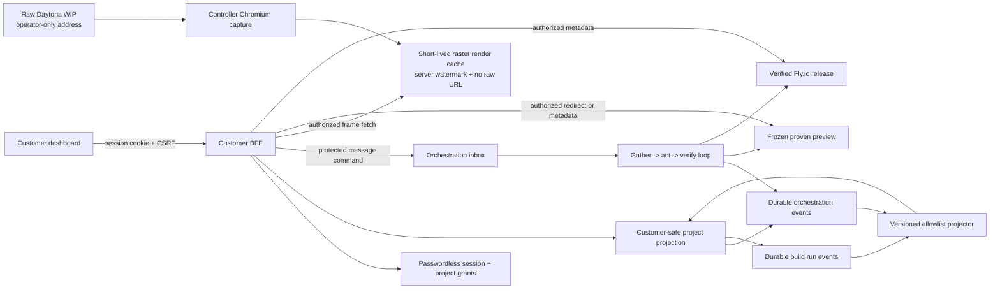

# BuildLabs Admin Dashboard

> **Product and implementation specification for the admin/operator workspace.**
>
> ---
>
> **Consolidation note (2026-07):** This document was originally written as the
> _Customer Dashboard_ spec. The product decision has been made to consolidate
> the customer-facing dashboard into the admin/operator Studio as the single
> dashboard surface. The separate customer-facing workspace is no longer
> planned. This spec is being updated to reflect the admin dashboard, but the
> deep technical sections (API routes, TypeScript interfaces, auth flows in
> sections 7–11) still reference the original `customer-dashboard` route names
> and `Customer*` type names — these will need to be renamed in the codebase
> alongside this spec.
>
> **⚠️ Conflict with PRODUCT_SPEC.md:** `PRODUCT_SPEC.md` and `AGENTS.md`
> currently define the customer dashboard as a load-bearing part of the product
> (passwordless customer access, sanitized WIP projection, proven preview
> delivery). Those documents have **not yet been updated** to reflect this
> consolidation. Until they are, any conflict between this file and
> `PRODUCT_SPEC.md` is resolved in favour of the product spec per AGENTS.md.
>
> ---

## Table of contents

| Section                                               | Title                                     |
| ----------------------------------------------------- | ----------------------------------------- |
| [1](#1-product-definition)                            | Product definition                        |
| [2](#2-goals-and-non-goals)                           | Goals and non-goals                       |
| [3](#3-non-negotiable-truth-rules)                    | Non-negotiable truth rules                |
| [4](#4-admin-journey)                                 | Admin journey                             |
| [5](#5-information-architecture)                      | Information architecture                  |
| [6](#6-display-states)                                | Display states                            |
| [7](#7-passwordless-authentication-and-authorization) | Authentication and authorization          |
| [8](#8-admin-api-contract)                            | Admin API contract                        |
| [9](#9-projection-and-orchestration-architecture)     | Projection and orchestration architecture |
| [10](#10-wip-and-preview-isolation)                   | WIP and preview isolation                 |
| [11](#11-security-and-privacy-requirements)           | Security and privacy requirements         |
| [12](#12-visual-and-interaction-system)               | Visual and interaction system             |
| [13](#13-copy-rules)                                  | Copy rules                                |
| [14](#14-frontend-component-inventory)                | Frontend component inventory              |
| [15](#15-telemetry)                                   | Telemetry                                 |
| [16](#16-acceptance-criteria)                         | Acceptance criteria                       |
| [17](#17-implementation-sequence)                     | Implementation sequence                   |

---

## 1. Product definition

The admin dashboard is BuildLabs's operator workspace — the single surface where
an operator manages projects, observes live builds, reviews evidence, approves
steering, and tracks delivery. It replaces the previously planned separate
customer-facing dashboard with one consolidated operator surface.

The dashboard gives the operator:

- **Scope and contract visibility** — a clear view of the approved scope and
  current contract version for each project.
- **Live build observability** — near-real-time observability across up to four
  independent Daytona builders, including raw mutable previews, complete
  evidence, and operational failures.
- **Durable timeline** — a timeline of implementation, verification, preview,
  and deployment events.
- **Steering management** — one place to submit, review, and classify steering
  requests.
- **Proven preview and production access** — access to immutable proven previews
  and the verified production release.

Unlike the former customer dashboard design, the admin dashboard has **full
operator privileges**. It may inspect raw mutable Daytona previews, complete
evidence, operational failures, sandbox identifiers, and internal provider
state. There is no sanitized WIP projection layer — the operator sees the real
builder output directly.

The experience should feel as legible and responsive as the best AI application
builders. "Live" means the dashboard is replaying controller-recorded activity
and, when available, the actual builder workspace as work happens.

### 1.1 Visual surfaces

With the customer dashboard consolidated into the admin dashboard, BuildLabs has
three visual surfaces:

| Surface                     | Audience | Mutability                              | What it shows                                                                                |
| --------------------------- | -------- | --------------------------------------- | -------------------------------------------------------------------------------------------- |
| Raw Daytona builder preview | Operator | Mutable                                 | Direct sandbox web view, operational inspection, and privileged recovery                     |
| Frozen proven preview       | Operator | Immutable                               | The exact Daytona delivery snapshot and contract version that passed the complete proof gate |
| Production release          | Public   | Replaced only by a later proven release | The exact proven artifact deployed and health-verified on Fly.io                             |

The raw Daytona builder URL is now directly accessible from the admin dashboard.
The former "customer WIP observation" layer (sanitized, controller-rendered,
labeled `UNVERIFIED WIP`) is no longer a separate surface — the operator sees
the real builder workspace without sanitization.

## 2. Goals and non-goals

### 2.1 Goals

1. Let an operator understand and control what BuildLabs is doing across all
   active projects.
2. Represent all allocated builders independently, including disagreement,
   repair, rejection, failure, and idle states.
3. Make every displayed status traceable to a durable controller event or
   verified receipt.
4. Let dashboard and email steering converge on one ordered, immutable project
   history.
5. Keep the last proven preview or production release available while a newer
   revision is being built and proved.
6. Work comfortably on desktop and mobile.
7. Prevent project-to-project data leakage across operator sessions.

### 2.2 Non-goals

- Exposing model chain of thought, model prompts, Braintrust trace IDs, or
  secrets in the UI (these remain backend-only).
- Treating a builder's self-reported completion as proof.
- Letting an operator choose an unproved candidate for delivery.
- Letting a dashboard instruction bypass price approval, verified payment,
  acceptance-contract versioning, proof, or deployment verification.
- Adding WorkOS or enterprise organizations and roles. Version 1 uses a
  first-party operator session.
- Claiming that a generated persistent application can be delivered before its
  required resources are represented in a contract-bound provisioner.

## 3. Non-negotiable truth rules

The UI and API must enforce these rules, not merely describe them:

1. **No payment, no build.** The dashboard can show proposal or payment status,
   but no builder may enter an active state until the exact pinned proposal is
   paid and the payment receipt is verified.
2. **Live observation is not proof.** Build panes may show raw mutable previews
   and activity. A live preview never means an unproved application is
   approvable, downloadable, deployable, or safe to treat as a proven release.
3. **No fabricated progress.** Every activity item, count, stage, and timestamp
   comes from durable state. The client must not simulate terminal text, animate
   fake steps, infer percentage complete, or cycle placeholder messages.
4. **Unproved is labeled unproved.** `running`, `reviewing`, `evaluating`, and
   `passed` builder states do not mean a deliverable exists. Only a
   controller-accepted `candidate.proven` event can authorize an immutable
   preview.
5. **Hard failures stay hard.** A high design or preference score cannot conceal
   a failed hard requirement. Candidate ranking is shown only after proof and
   only among proven candidates.
6. **Old proof cannot authorize new scope.** A steering request creates contract
   version `N+1`. Proof for version `N` remains historical and cannot authorize
   the new version.
7. **The current release remains explicit.** While `N+1` is being built, the UI
   may link to proven preview or production version `N`, but must label it
   "Current proven version" and never "Latest requested version."
8. **Unknown stays unknown.** Provider silence, a disconnected stream, a stale
   projection, or a missing receipt is displayed as unavailable, delayed, or
   awaiting evidence. It is never converted into success.
9. **Production means verified production.** The production link appears only
   after the Fly.io receipt binds the exact project, contract, candidate,
   revision, artifact and image digests, release identity, HTTPS health, and
   verification timestamps.

## 4. Admin journey

### 4.1 Intake and identity

> **Note:** The intake flow (voice, email verification) remains a
> customer-facing process at the product level. The admin dashboard observes and
> manages it but does not replace it.

The browser voice intake, future Plivo voice adapter, or message intake collects
the customer's name, email, phone, scope, and quote as described in the product
spec. Voice-captured fields are transcribed once without a spoken read-back or
personal-detail confirmation turn. Transcription confidence is not identity
proof.

Voice-captured email begins as unverified. Before BuildLabs sends a proposal,
Resend sends a one-time passwordless link to that address. Consuming the link
proves email possession, rotates into a project-scoped session, and permits the
proposal flow to continue. This does not permit BuildLabs to guess a missing or
contradictory email; a bad transcription simply prevents the intended customer
from receiving the link and requires a focused correction. Phone is never used
as dashboard authentication in version 1.

### 4.2 Verification and build-start links

> **Note:** These link flows are customer-facing mechanisms. The admin dashboard
> observes their state and can trigger reissues, but the operator is not the
> link recipient.

BuildLabs uses the same passwordless mechanism at two distinct moments:

1. **Pre-proposal ownership verification.** After voice intake, the orchestrator
   records one idempotent verification-link effect. Resend sends a
   project-bound, one-time link. Consuming it verifies the normalized email and
   creates the initial project session. No proposal or payment link is sent to
   an email whose ownership has not been established.
2. **Build-start access.** After the exact proposal is paid and the complete
   requested build batch is durably dispatched, the orchestrator records one
   idempotent `send_dashboard_access` effect. Resend sends a project-specific
   dashboard link in the existing customer thread and explains that construction
   has started. An existing valid session may open the project immediately; an
   expired or absent session exchanges the new one-time link.

The customer never creates or remembers a password. A send failure must be
visible to the operator and retried through the outbox. It does not prove email
delivery, token consumption, or a dashboard session and must not be described as
any of those states.

### 4.3 Build observation

The operator sees four stable builder lanes. Only the number requested by the
active build batch can become allocated. Unused lanes say `Not allocated`; they
must not impersonate agents.

For each allocated builder, the operator can see:

- its stable display name, such as `Builder 1`;
- controller state and stage;
- last recorded activity time;
- tool progress counts;
- normalized activity such as editing files, running the configured build,
  starting a local preview, repairing a review finding, or entering independent
  verification;
- **direct access to the raw mutable Daytona preview** (no sanitization layer);
- raw stdout/stderr and terminal output;
- source file contents, diffs, and patches;
- proof checks as they become available;
- an honest terminal outcome.

The visual pane shows the actual builder workspace directly — no
`UNVERIFIED WIP` watermark, no controller-rendered raster proxy. The operator
has full operational inspection and privileged recovery access.

The operator should not see in the dashboard UI:

- Fireworks reasoning, prompts, or Braintrust trace IDs (these remain
  backend-only);
- another project's data unless explicitly switching projects;
- provider credentials or secrets.

### 4.4 Steering

An operator can submit a change from the dashboard or reply to the correlated
email thread. Both paths enter the same orchestration inbox.

Submitting from the dashboard means only "BuildLabs received this request." The
UI must not immediately say the change was accepted, implemented, or in scope.
The orchestrator then classifies it:

- missing or conflicting detail produces a focused clarification;
- an in-scope change produces immutable contract version `N+1`;
- commercially material expansion returns to a versioned proposal and payment
  gate;
- a duplicate is linked to its existing request and does not create another
  build;
- invalid or instruction-injection content is rejected without bypassing policy.

Every result is shown in the shared Updates timeline and sent through the
existing email thread when an email response is required.

### 4.5 Preview and delivery

When a candidate is proven, deterministic ranking selects from proven candidates
only. The dashboard may then show an immutable preview for the selected
candidate. The preview panel must state:

- contract version;
- verified revision;
- that the preview is frozen;
- what the automated gate did and did not verify;
- expiry or revocation status, if applicable.

After the same artifact is deployed and independently health-verified, the
dashboard shows the production URL as the delivered release. A later steering
request does not take the current production release down. It starts a new
version whose progress is tracked separately.

## 5. Information architecture

### 5.1 Global shell

The shell is a quiet operational workspace, not a marketing page.

**Desktop, 1024 px and wider**

- Top bar: BuildLabs wordmark, project switcher when more than one project is
  authorized, masked account email, and session menu.
- Project bar: project title, requested contract version, lifecycle status,
  stream freshness, and the current proven/production version when different.
- Left navigation: `Overview`, `Build`, `Requirements`, `Proof`, and `Updates`.
- Main content: one unframed page region with a maximum readable width. Builder
  lanes may use the full available width.
- Optional right detail panel: selected activity, proof check, or steering
  receipt. It is a drawer, not a nested card.

**Tablet, 768-1023 px**

- Top navigation becomes a horizontally scrollable tab row.
- Builder lanes use a two-column grid.
- Details open as a modal sheet.

**Mobile, below 768 px**

- Compact project header with lifecycle and freshness on separate lines.
- Bottom navigation: `Overview`, `Build`, `Proof`, and `Updates`.
- Requirements appear as a section in Overview and remain directly linkable.
- Builder lanes are a single-column list. Lane height is stable while live
  labels change.
- Detail views use full-height sheets. The steering composer remains reachable
  above the safe-area inset and never covers timeline content.

### 5.2 Overview

The Overview answers four questions in this order:

1. **What did I approve?** Current contract version, short scope, paid
   commercial basis, and link to requirements.
2. **What is happening now?** Customer-facing lifecycle, current milestone, last
   durable update, and stream freshness.
3. **What can I do?** Pay, answer clarification, watch, review a proven preview,
   open production, or submit steering. Show exactly one primary action.
4. **What is safely available?** Current proven preview and current production
   release, each with its own version.

Use a horizontal milestone rail on desktop and a vertical list on mobile:

`Scope -> Payment -> Build -> Proof -> Preview -> Production`

Completed milestones require their corresponding durable receipt. A milestone
may be `not_started`, `active`, `complete`, `blocked`, or `superseded`. Do not
derive a percentage from these milestones.

### 5.3 Build

The Build view is the center of the experience.

Each builder lane has a stable structure:

1. Header: builder name, allocation state, stage, and last update.
2. WIP viewport: a stable 16:10 raster surface with a persistent
   `UNVERIFIED WIP` banner, capture timestamp, and unavailable/stale states.
3. Activity strip: current controller-recorded action and outcome icon.
4. Counters: completed tool calls, failed tool calls, repair round, proof
   receipts.
5. Timeline: newest-first structured events, with a chronological toggle.
6. Outcome: `In progress`, `Sent to proof`, `Proven`, `Rejected`, `Failed`,
   `Cancelled`, or `Superseded`.

The default desktop layout is a two-by-two grid. Customers can select
`All activity` to view one interleaved timeline ordered by server sequence. A
builder lane is an individual repeated item and may use a card with an 8 px or
smaller radius. Do not place cards inside it.

The WIP viewport is non-interactive. Selecting it opens a larger observation
sheet with the same raster frame and activity timeline, not the generated
application. The frame must never navigate, submit forms, run generated
JavaScript, or receive keyboard focus as an application. Steering stays in the
dashboard composer.

Allowed customer activity labels are controller-owned and finite:

| Action                      | Customer label                                        |
| --------------------------- | ----------------------------------------------------- |
| `sandbox_provisioning`      | Preparing an isolated workspace                       |
| `files_listing`             | Inspecting the project structure                      |
| `file_reading`              | Reviewing project files                               |
| `file_writing`              | Updating project files                                |
| `command_running`           | Running a project command                             |
| `dependency_bootstrap`      | Restoring locked dependencies                         |
| `build_running`             | Building the application                              |
| `test_running`              | Running configured tests                              |
| `operator_preview_starting` | Starting an internal build preview                    |
| `revision_freezing`         | Freezing this revision for independent checks         |
| `command_verification`      | Verifying build and requirements in a clean workspace |
| `delivery_verification`     | Building the delivery image in a clean workspace      |
| `code_review`               | Running independent code review                       |
| `contract_evaluation`       | Checking the Acceptance Contract                      |
| `claim_inspection`          | Checking rendered claims and supported facts          |
| `repairing`                 | Repairing a recorded issue                            |
| `finalizing`                | Finalizing evidence                                   |
| `waiting`                   | Waiting for the next recorded step                    |

`command_running` may include only a controller-defined label such as
`Configured test command`; never include the original command text. File
activity may include a count and validated workspace-relative paths, capped at
10 paths per event. A diff summary may include only controller-counted files,
additions, and deletions. It must not include contents, patches, or unbounded
names.

### 5.4 Requirements

Requirements are grouped into:

- hard requirements;
- preferences;
- approved business facts with customer-safe citations;
- forbidden or unsupported claims;
- unknowns and explicit exclusions;
- verification plan.

The header always shows contract version and digest abbreviation. Historical
versions are read-only. A version comparison shows customer-facing requirement
changes, not raw source diffs or model output.

A hard requirement status is one of `not_checked`, `checking`, `pass`, `fail`,
or `unverified`. Preference scores are hidden until the candidate passes every
hard gate, because they must never distract from a hard failure.

### 5.5 Proof

Proof is organized by candidate and then by check:

- source artifact integrity;
- dependency bootstrap;
- build;
- configured tests;
- controller-issued requirement commands;
- rendered HTTP requirements;
- unsupported-claim scan;
- visual claim inspection;
- CodeRabbit review;
- Fireworks contract evaluation;
- deterministic final gate.

Each row includes status, completion time, plain-language scope, and a bounded
explanation. Customer-safe evidence references may be shown, but raw command
output, screenshots containing unproved content, internal storage paths, and
provider trace identifiers are excluded.

Proof status meanings:

| Status       | Meaning                                          |
| ------------ | ------------------------------------------------ |
| `pending`    | No receipt exists yet                            |
| `running`    | A controller-started check is active             |
| `pass`       | The exact receipt passed for this revision       |
| `fail`       | The check produced a deterministic failure       |
| `error`      | The check could not establish pass or fail       |
| `superseded` | The receipt belongs to an older contract version |

The candidate banner may say `Proven` only after the complete gate passes. A
check error is not a failure and is not a pass; it keeps the candidate unproved.

### 5.6 Updates

Updates is one ordered conversation and decision timeline for:

- dashboard steering submissions;
- authenticated inbound email steering;
- BuildLabs clarification questions;
- proposal and contract versions;
- payment confirmation;
- preview availability;
- deployment and delivery.

Each entry identifies its channel as `Dashboard`, `Email`, or `BuildLabs`. Email
bodies are not mirrored automatically. The projection stores and renders a
customer-safe summary with a link to the resulting version or action. This
avoids duplicating private thread content into broadly consumed event records.

The composer:

- accepts plain text up to 10,000 UTF-8 bytes;
- displays the active contract version the request will branch from;
- requires no confirmation modal for normal submission;
- uses an idempotency key so retrying after a network failure cannot duplicate
  the request;
- disables only while that exact request is being submitted;
- acknowledges `Received`, then replaces that state with the orchestrator's
  durable classification;
- does not support attachments in version 1.

## 6. Display states

### 6.1 Admin-facing lifecycle

The API retains the canonical lifecycle value and sends a separate
customer-facing label. The frontend must not reinterpret it.

| Canonical state                  | Customer label                  | Primary behavior                                 |
| -------------------------------- | ------------------------------- | ------------------------------------------------ |
| `intake_received`                | Reviewing your request          | No build activity                                |
| `needs_clarification`            | Details needed                  | Show the focused question                        |
| `researching`                    | Gathering approved context      | Show sources only after capture and sanitization |
| `proposal_drafting`              | Preparing your proposal         | No payment or build claim                        |
| `awaiting_customer_revision`     | Waiting for your response       | Open Updates                                     |
| `awaiting_payment`               | Payment needed                  | Show exact proposal version and Checkout action  |
| `payment_verification_failed`    | Payment needs attention         | Do not imply paid                                |
| `paid`                           | Payment verified                | Build has not necessarily started                |
| `building`                       | Building your project           | Enable live structured builder activity          |
| `verifying`                      | Proving this version            | Keep builder outcomes distinct                   |
| `no_proven_candidate`            | No version passed proof         | Show what failed and next durable action         |
| `preview_ready`                  | Proven preview ready            | Show only the immutable preview                  |
| `revision_pending`               | Processing your changes         | Show current proven version separately           |
| `deploying`                      | Deploying the proven version    | Production link remains unavailable              |
| `deployment_verification_failed` | Deployment needs attention      | Preserve the prior known-good release            |
| `delivering`                     | Confirming delivery             | Do not imply the email was delivered             |
| `completed`                      | Delivered                       | Show verified production and proof summary       |
| `cancelled`                      | Project cancelled               | Read-only history                                |
| `failed`                         | Project stopped                 | Read-only evidence and contact path              |
| `needs_operator_attention`       | BuildLabs is resolving an issue | No invented ETA or progress                      |

### 6.2 Builder state

The view combines the backend run `status` and `stage` without collapsing their
meaning.

Run status:

- `queued`: accepted by the controller, not executing;
- `running`: an active run exists;
- `passed`: the build run reached its successful terminal state, but the project
  may still be ranking, previewing, deploying, or delivering;
- `rejected`: evidence failed a gate;
- `failed`: infrastructure or bounded execution failed;
- `cancelled`: the controller confirmed cancellation.

Run stage:

`queued`, `provisioning`, `generating`, `verifying`, `reviewing`, `evaluating`,
`finalizing`, or `complete`.

The customer projection adds:

- `not_allocated`: this lane was not assigned for the active batch;
- `superseded`: this run belongs to an older contract version;
- `awaiting_proven_event`: the run ended successfully but the orchestrator has
  not yet accepted its authenticated proof event.

### 6.3 Stream freshness

Stream health is separate from build status:

| Freshness        | Rule                                             | UI                                         |
| ---------------- | ------------------------------------------------ | ------------------------------------------ |
| `connecting`     | Initial snapshot not received                    | Static skeleton, no fake activity          |
| `live`           | Snapshot or keepalive received within 30 seconds | `Live` with last event time                |
| `reconnecting`   | Connection lost for up to 90 seconds             | Retain data and reconnect                  |
| `delayed`        | No server contact for more than 90 seconds       | `Updates delayed`; no state inference      |
| `offline`        | Browser reports no network                       | Retain last durable snapshot and timestamp |
| `reset_required` | Cursor is no longer replayable                   | Fetch a complete snapshot before resuming  |

No pulsing activity indicator may imply that a builder is working unless its
durable run status is `running`. A healthy keepalive indicates transport health,
not agent activity.

### 6.4 WIP render state

WIP render state is independent from run status and proof:

| State             | Meaning                                                           |
| ----------------- | ----------------------------------------------------------------- |
| `unavailable`     | No customer-renderable frame exists                               |
| `starting`        | A builder workspace is active but no safe frame has been captured |
| `live_unverified` | A fresh controller-rendered frame is available                    |
| `stale`           | The last frame is visible but older than the freshness limit      |
| `blocked`         | The render gateway rejected or could not sanitize the source      |
| `ended`           | The mutable builder workspace is no longer available              |

`live_unverified` never implies `passed` or `proven`. The dashboard displays the
frame only when `customerRenderable` is `true`. The backend foundation currently
sets that field to `false`, so the frontend must show `WIP render unavailable`
until the target render gateway is implemented and has issued a fresh frame.

### 6.5 Preview and release states

Customer preview:

- `unavailable`: no selected proven candidate;
- `materializing`: a proven candidate exists but immutable preview creation is
  not yet verified;
- `ready`: exact immutable preview receipt exists and is HTTPS healthy;
- `expired`: receipt expiry passed;
- `revoked`: access was explicitly revoked;
- `superseded`: a newer requested contract version exists.

Production:

- `unavailable`;
- `deploying`;
- `verification_failed`;
- `current`;
- `replaced`.

A `superseded` preview or `replaced` release remains historical and clearly
versioned. It must never become the default link for the latest requested
version.

## 7. Passwordless authentication and authorization

### 7.1 Authentication model

Version 1 uses first-party, passwordless email authentication delivered by
Resend. It does not require WorkOS and does not create a general multi-tenant
organization system.

The implemented flow is:

1. The orchestrator creates a signed login capability containing its purpose,
   exact project ID, normalized-email digest, issuance and expiry times, and a
   nonce. Login capabilities expire after 15 minutes by default.
2. Resend receives a URL ending in
   `/v1/orchestration/customer-dashboard/access#token=...`. The capability is in
   the fragment, so a normal HTTP GET, mail-security prefetch, reverse proxy,
   and access log do not receive it.
3. `GET /v1/orchestration/customer-dashboard/access` returns a small inert
   exchange page. Query strings and token-bearing path variants are rejected.
4. The page reads the fragment locally, removes it from browser history, and
   posts the token to the same path. A scanner that only fetches the URL cannot
   consume it.
5. The POST verifies the capability signature, purpose, expiry, project, and
   email digest against protected project state. Invalid, expired, mismatched,
   and replayed capabilities share one generic `404` response.
6. The project save atomically records the token SHA-256 digest in an immutable
   one-time-consumption table and records the passwordless ownership event.
   Pre-proposal exchange changes that exact email from unverified to verified;
   post-dispatch exchange re-establishes access without trusting a browser email
   claim.
7. A successful exchange returns the project dashboard path and sets a signed
   project/email-bound session plus its session-derived CSRF cookie.
8. If exchange returns a non-success response, the exchange page posts the same
   fragment capability to
   `POST /v1/orchestration/customer-dashboard/access/requests`. Reissue accepts
   only an authentic login capability that is still active or expired within the
   last 30 days. It rechecks the signed project/email digest against protected
   state, ignores any browser identity claim, and sends only to the stored
   project address.

The reissue route always returns the same `202 {"status":"accepted"}` for valid,
malformed, too-old, mismatched, throttled, and provider-failed requests. A
signed capability digest can create only one durable request family, so
replaying the same capability cannot queue another replacement. A project
accepts at most 32 distinct request families. Different eligible families are
separated by a durable one-minute project floor.

If a provider has not completed delivery before the 15-minute capability
expires, the same family can rotate, but no passwordless-link family may exceed
three delivery generations. A reissue command that loses an optimistic aggregate
compare-and-set reloads protected state and retries no more than three times.
These are bounded durability controls, not an edge-wide abuse control.

There is no public "enter an email to request a link" endpoint yet. Initial
links originate from durable orchestrator email effects, and reissue requires an
existing signed capability, so the browser never chooses its project or identity
claim.

### 7.2 Session policy

- Session cookie: `buildlabs_dashboard_session`, `Secure`, `HttpOnly`,
  `SameSite=Strict`, `Path=/v1/orchestration/customer-dashboard`, with no
  `Domain`.
- CSRF cookie: `buildlabs_dashboard_csrf`, `Secure`, `SameSite=Strict`,
  `Path=/`, readable by the future frontend.
- Absolute session lifetime: seven days by default. The session is a stateless
  signed capability with a fresh nonce, not a database session.
- CSRF: dashboard mutations require the CSRF cookie and `x-buildlabs-csrf`
  header to match in constant time and to match the token derived from the
  signed session.
- Project access: every read and mutation verifies the session signature,
  expiry, exact project ID, verified-email state, and current normalized-email
  digest. Route possession is not authorization.
- Signing-root rotation invalidates outstanding login links and sessions.

Idle timeout, explicit logout, renewal, per-session or per-project server-side
revocation, privilege-change rotation, typed-email link requests, and edge-wide
dashboard rate limiting are not implemented. The durable one-minute reissue send
floor is defense in depth, not a replacement for those controls. They remain
required before treating the browser surface as a complete production identity
system.

### 7.3 Authorization rules

- Each current session is bound to exactly one project and one verified email
  digest.
- The implemented capability set is project snapshot read, bounded customer-safe
  event-window read, and steering submit. Proven preview and production URLs are
  returned only when backed by their existing verified receipts.
- Internal operator APIs, build artifact URLs, raw build events, and privileged
  evidence APIs reject customer sessions.
- Existing proof-summary bearer links are not login credentials and cannot be
  exchanged for a dashboard session.
- Changing the customer email is an operator-mediated protected workflow, not a
  dashboard profile edit.
- The current REST projection exposes controller project, batch, run, and
  candidate IDs. Customer-specific opaque aliases are not implemented yet, so a
  future frontend must not imply those values are stable public identifiers.

## 8. Admin API contract

> **Note:** The route paths and type names below still use the original
> `customer-dashboard` and `Customer*` naming from the implemented backend.
> These will need to be renamed to `admin-dashboard` / `Admin*` in the codebase
> to match this consolidation.

The implemented backend routes are under
`/v1/orchestration/customer-dashboard/...` and are documented first. The later
`/v1/customer/...` shapes in sections 8.2 through 8.5 are the proposed,
frontend-oriented BFF contract; they are not routes that exist today. A future
BFF may adapt the implemented boundary, but must never give the browser direct
access to the build backend or orchestration store.

Implemented dashboard responses:

- use JSON except the access exchange page;
- set `Cache-Control: private, no-store`;
- include `X-Content-Type-Options: nosniff`;
- apply restrictive CSP, referrer, framing, robots, resource, and permissions
  policies;
- omit provider secrets, contact PII, raw source content, sandbox identifiers,
  and provider identifiers;
- verify a signed, project/email-bound dashboard session before returning
  project state.

### 8.1 Implemented backend routes

Passwordless access exchange:

```http
GET /v1/orchestration/customer-dashboard/access
```

This returns only the scanner-safe exchange HTML. A token in the query string or
path is rejected. The emailed token exists only in the URL fragment and
therefore is not part of this GET request. The exchange page performs:

```http
POST /v1/orchestration/customer-dashboard/access
Content-Type: application/json

{"token":"<fragment token>"}
```

On success the response sets `buildlabs_dashboard_session` and
`buildlabs_dashboard_csrf` cookies and returns:

```json
{
  "redirectTo": "/dashboard/projects/<project-id>"
}
```

The token is consumed only as part of the durable ownership transaction. A
second POST, expired token, wrong project/email binding, bad signature, query
token, or token-bearing GET path returns the same generic
`404 customer_dashboard_access_not_found`.

Bounded access-link reissue:

```http
POST /v1/orchestration/customer-dashboard/access/requests
Content-Type: application/json

{"token":"<original fragment token>"}
```

This route does not accept an email address or project ID. It considers only a
correctly signed login capability that is active or no more than 30 days past
expiry, then rechecks its project and email digest against the protected
aggregate. If eligible, it queues and sends a new 15-minute capability only to
the stored address. Every outcome is deliberately identical:

```json
{
  "status": "accepted"
}
```

The status is always `202`, including malformed, too-old, mismatched,
suppressed, provider-failed, and accepted requests. Durable
`send_dashboard_login` effect generations enforce one pending send at a time and
at least one minute between per-project generation creation. If an unsent
verification, access, or reissue capability reaches its 15-minute expiry, the
orchestrator fails that generation with
`login_capability.expired_before_delivery` and creates a new generation with a
fresh expiry rather than emailing a stale token.

Project snapshot:

```text
GET /v1/orchestration/customer-dashboard/projects/:projectId
```

The versioned response contains the project `status` and `revision`, current
plan, exact payment state, active build batch and its runs, observation
availability, the latest still-valid frozen proven preview, and the latest
healthy production deployment. The last known-good preview and production URL
remain visible while a newer revision is building. An unavailable build backend
degrades a run to explicit orchestration-index telemetry; it never fabricates
activity.

Current run views include controller `runId` and `candidateId`, telemetry
source, status, stage, slot, aggregate tool progress, proof counts, a bounded
timeline, and:

```ts
workspace: {
  state: "unavailable" | "starting" | "live_unverified";
  customerRenderable: false;
}
```

Opaque project, batch, run, and candidate aliases are not implemented yet.

Bounded project event window:

```text
GET /v1/orchestration/customer-dashboard/projects/:projectId/events
    ?afterSequence=<non-negative integer>&limit=<1..250>
```

The default limit is 100. It returns `items`, `nextAfterSequence`, and
`hasMore`. Each item contains only `sequence`, `type`, `actor`, `status`,
`runId`, `candidateId`, and `occurredAt`; raw orchestration event payloads do
not cross this boundary. This is paginated REST, not SSE.

Steering:

```http
POST /v1/orchestration/customer-dashboard/projects/:projectId/steering
Content-Type: application/json
x-buildlabs-csrf: <value from buildlabs_dashboard_csrf cookie>
Idempotency-Key: <stable command key>

{
  "expectedRevision": 42,
  "expectedProposalVersion": 3,
  "subject": "Mobile appointment flow",
  "content": "Please make the appointment form the first action on mobile."
}
```

The route verifies the signed session, exact project/email binding,
session-derived double-submit CSRF token, stable idempotency key, expected
aggregate revision, and expected proposal version. It then enters the same
protected `receiveCustomerMessage` workflow as authenticated email with
`source: "dashboard"`. The successful `202` response means only that the request
was received:

```json
{
  "received": true,
  "project": {
    "projectId": "<project-id>",
    "status": "<current-status>",
    "revision": 43
  }
}
```

There is no separate steering-status route yet. The project snapshot and REST
event window are the current readback surfaces.

The orchestration service obtains per-run activity server-to-server from the
build backend:

```text
GET /v1/build-runs/:runId/customer-observability
    ?afterSequence=<non-negative integer>&limit=<1..250>
Authorization: Bearer <build-backend internal token>
```

This is an internal route, not a customer browser route. Its versioned allowlist
contains run status/stage, slot state, aggregate tool progress, proof counts by
kind, and bounded entries categorized as `workspace`, `stage`, `tool`,
`evidence`, or `lifecycle`. It omits sandbox IDs and URLs, commands and output,
filesystem content, prompts, reasoning, credentials, and raw event payloads. It
returns no frame identity or pixels and always sets `customerRenderable: false`.

Still missing from the implemented contract are the Next.js/CopilotKit frontend,
typed-email public link request and session/logout routes, opaque customer
aliases, resumable SSE, controller-rendered raster WIP metadata/frame routes,
server-side session revocation/renewal, and edge-wide dashboard rate limits.

### 8.2 Target authentication

```http
POST /v1/customer/auth/magic-links
Content-Type: application/json

{"email":"customer@example.com"}
```

Response is always:

```json
{ "status": "accepted" }
```

```http
POST /v1/customer/auth/sessions
Content-Type: application/json

{"token":"<fragment token>"}
```

On success, set the session cookie and return:

```json
{
  "account": {
    "maskedEmail": "c***@example.com"
  },
  "projects": [
    {
      "projectId": "opaque-customer-project-id",
      "title": "Project title"
    }
  ],
  "csrfToken": "session-bound-token"
}
```

Other auth routes:

```text
GET    /v1/customer/auth/session
DELETE /v1/customer/auth/session
```

### 8.3 Target project snapshot

```text
GET /v1/customer/projects
GET /v1/customer/projects/:projectId
```

The project response is a complete resumable snapshot:

```ts
interface CustomerProjectSnapshot {
  schemaVersion: 1;
  projectId: string;
  aggregateRevision: number;
  eventCursor: number;
  title: string;
  lifecycle: {
    canonical: ProjectLifecycleStatus;
    label: string;
    changedAt: string;
  };
  requestedVersion: number | null;
  paidCommercialVersion: number | null;
  currentProvenVersion: number | null;
  currentProductionVersion: number | null;
  milestoneStates: Array<{
    id: "scope" | "payment" | "build" | "proof" | "preview" | "production";
    state: "not_started" | "active" | "complete" | "blocked" | "superseded";
    receiptAt: string | null;
  }>;
  activeBatch: CustomerBuildBatch | null;
  contract: CustomerContractSummary | null;
  proof: CustomerProofSummary | null;
  preview: CustomerPreviewSummary | null;
  production: CustomerProductionSummary | null;
  pendingAction:
    | "none"
    | "answer_clarification"
    | "pay"
    | "watch"
    | "review_preview"
    | "open_production";
  updatedAt: string;
}
```

`ProjectLifecycleStatus` is the canonical enum in section 6.1.

```ts
interface CustomerBuildBatch {
  batchId: string;
  contractVersion: number;
  state:
    | "pending"
    | "dispatched"
    | "building"
    | "verifying"
    | "completed"
    | "failed"
    | "cancelled"
    | "superseded";
  requestedBuilderCount: 1 | 2 | 3 | 4;
  builders: [
    CustomerBuilder,
    CustomerBuilder,
    CustomerBuilder,
    CustomerBuilder,
  ];
  startedAt: string | null;
  completedAt: string | null;
}

interface CustomerBuilder {
  builderId: string;
  displayName: "Builder 1" | "Builder 2" | "Builder 3" | "Builder 4";
  allocation: "not_allocated" | "allocated";
  status:
    | "queued"
    | "running"
    | "passed"
    | "rejected"
    | "failed"
    | "cancelled"
    | "superseded"
    | "awaiting_proven_event";
  stage:
    | "queued"
    | "provisioning"
    | "generating"
    | "verifying"
    | "reviewing"
    | "evaluating"
    | "finalizing"
    | "complete"
    | null;
  progress: {
    completedToolCalls: number;
    failedToolCalls: number;
    repairRound: number;
    proofReceiptCount: number;
  };
  workspace: {
    state:
      | "unavailable"
      | "starting"
      | "live_unverified"
      | "stale"
      | "blocked"
      | "ended";
    customerRenderable: boolean;
    latestFrameId: string | null;
    capturedAt: string | null;
  };
  currentActivity: CustomerBuilderActivity | null;
  updatedAt: string | null;
  completedAt: string | null;
}
```

The BFF assigns customer-safe `batchId` and `builderId` aliases. They must not
be reversible provider, sandbox, run, or candidate identifiers.

Supporting reads:

```text
GET /v1/customer/projects/:projectId/contract?version=N
GET /v1/customer/projects/:projectId/proof?version=N
GET /v1/customer/projects/:projectId/updates?after=<cursor>&limit=<1..100>
GET /v1/customer/projects/:projectId/builders/:builderId/wip
GET /v1/customer/projects/:projectId/builders/:builderId/wip/frames/:frameId
GET /v1/customer/projects/:projectId/previews/:version
GET /v1/customer/projects/:projectId/releases/:version
```

The WIP metadata route returns only state, frame identity, capture time, pixel
dimensions, and expiry. The frame route returns an authenticated `image/png`
response with `Content-Disposition: inline`, `Cache-Control: private, no-store`,
`Cross-Origin-Resource-Policy: same-origin`, and
`X-Content-Type-Options: nosniff`. It never redirects to Daytona. A frame ID is
short-lived, project/builder/session-bound, and unusable after grant or session
revocation.

Until the render gateway exists, `customerRenderable` remains `false`,
`latestFrameId` remains `null`, and both WIP routes return
`404 wip_render_unavailable`. The frontend must not construct or request the
existing raw build preview endpoint.

### 8.4 Target event stream

```http
GET /v1/customer/projects/:projectId/events
Accept: text/event-stream
Last-Event-ID: <optional project sequence>
```

The stream sends one `snapshot` event first when no valid cursor is supplied,
then strictly ordered events after the cursor. Keepalives are SSE comments and
do not change project state.

```ts
interface CustomerEvent<T = CustomerEventData> {
  schemaVersion: 1;
  eventId: string;
  sequence: number;
  aggregateRevision: number;
  projectId: string;
  contractVersion: number | null;
  type: CustomerEventType;
  occurredAt: string;
  data: T;
}

type CustomerEventType =
  | "project.state_changed"
  | "contract.version_created"
  | "payment.verified"
  | "build.batch_started"
  | "build.batch_superseded"
  | "builder.state_changed"
  | "builder.activity_recorded"
  | "builder.wip_render_changed"
  | "proof.check_changed"
  | "candidate.outcome_recorded"
  | "preview.ready"
  | "preview.expired"
  | "preview.revoked"
  | "steering.received"
  | "steering.classified"
  | "clarification.requested"
  | "deployment.state_changed"
  | "production.ready"
  | "notification.state_changed";
```

Builder activity is deliberately narrow:

```ts
interface CustomerBuilderActivity {
  activityId: string;
  builderId: string;
  step: number | null;
  repairRound: number;
  action:
    | "sandbox_provisioning"
    | "files_listing"
    | "file_reading"
    | "file_writing"
    | "command_running"
    | "dependency_bootstrap"
    | "build_running"
    | "test_running"
    | "operator_preview_starting"
    | "revision_freezing"
    | "command_verification"
    | "delivery_verification"
    | "code_review"
    | "contract_evaluation"
    | "claim_inspection"
    | "repairing"
    | "finalizing"
    | "waiting";
  outcome: "started" | "succeeded" | "failed" | "cancelled" | "unknown";
  fileCount: number | null;
  safeRelativePaths: string[];
  diffStats: {
    filesChanged: number;
    additions: number;
    deletions: number;
  } | null;
  commandLabel: string | null;
  occurredAt: string;
}

interface CustomerWipRenderChanged {
  builderId: string;
  state:
    | "unavailable"
    | "starting"
    | "live_unverified"
    | "stale"
    | "blocked"
    | "ended";
  customerRenderable: boolean;
  latestFrameId: string | null;
  capturedAt: string | null;
  expiresAt: string | null;
}
```

The server constructs this object from an allowlist. Unknown upstream tool names
map to a content-free `waiting` or are omitted; they are never copied through.
WIP events contain frame metadata only. Raster bytes travel through the
authenticated frame route and never through SSE, JSON, logs, analytics, or the
durable event projection.

Replay behavior:

- A cursor ahead of durable history returns `409 cursor_ahead`.
- A valid cursor resumes with the next sequence.
- A cursor older than retained customer projections sends
  `project.reset_required`, closes the stream, and requires a new snapshot.
- Duplicate delivery of the same event ID is harmless.
- The client applies an event only when its sequence is exactly the previous
  sequence plus one. A gap triggers snapshot recovery.
- A stream capacity failure returns `429 stream_capacity_exceeded` with a
  bounded `Retry-After`.

The customer stream is not the existing privileged AG-UI observer endpoint. The
BFF may consume the same durable sources, but it must emit only the
customer-safe projection defined here.

### 8.5 Target steering mutation

```http
POST /v1/customer/projects/:projectId/steering
Content-Type: application/json
X-CSRF-Token: <session token>
Idempotency-Key: <UUID>

{
  "expectedAggregateRevision": 42,
  "baseContractVersion": 3,
  "message": "Please make the appointment form the first action on mobile."
}
```

Accepted for processing:

```json
{
  "steeringId": "opaque-steering-id",
  "status": "received",
  "receivedAt": "2026-07-24T20:00:00.000Z"
}
```

Rules:

- `202` means received, not accepted into scope.
- The message is stored in the protected message record and represented in
  general events only by opaque identity and digest.
- The same session, project, and idempotency key must return the original
  response.
- Reusing the key with different content returns `409 idempotency_conflict`.
- A stale aggregate revision returns `409 project_changed` with the latest
  customer snapshot revision. The draft remains in the browser for review and
  resubmission.
- A base version older than the latest requested version is allowed only after
  the customer explicitly reloads and submits against the new version. The
  server never silently rebases text.
- Accepted email and dashboard messages are ordered by their durable inbox
  sequence. Concurrent messages create independent decisions. They are not
  silently merged.

Read one mutation:

```text
GET /v1/customer/projects/:projectId/steering/:steeringId
```

Its status is one of:

`received`, `needs_clarification`, `version_created`, `payment_required`,
`duplicate`, `rejected`, or `superseded`.

## 9. Projection and orchestration architecture

### 9.1 Components



This diagram is the complete target architecture. Today the orchestration HTTP
service provides the signed-session REST boundary, derived project projection,
bounded event read, and steering command. The customer browser application, SSE
transport, alias layer, capture service, and raster render cache shown here are
not implemented.

### 9.2 Read projection

The implemented customer project view is derived on each request from the
encrypted orchestration aggregate plus bounded internal build-observation
responses. It is versioned and preserves the last known-good proven preview and
healthy production release across a newer active build. It does not maintain a
separate replayed customer table yet, and it currently emits controller project,
batch, run, and candidate IDs.

The target customer projection is a derived, rebuildable read model. It stores:

- customer-safe project title;
- customer lifecycle and version pointers;
- aliased builder identities;
- sanitized activity;
- WIP render state and an opaque current-frame reference;
- contract and proof summaries;
- steering classification summaries;
- preview and production metadata;
- source event sequence and aggregate revision.

It does not store:

- raw intake or email bodies;
- name, full email, phone, billing or Stripe customer details;
- raw run event payloads;
- Daytona IDs or preview coordinates;
- source code, raw diffs, command output, or model text;
- durable WIP screenshot history; frames live only in the bounded render cache;
- raw proof receipts or Braintrust trace data.

Every projection schema has an explicit version. A projector that encounters an
unknown upstream event must ignore it safely and retain cursor continuity; it
must not serialize unknown fields. A schema change requires replay tests from
recorded redacted events.

### 9.3 Verification and build-start effects

The pre-proposal verification effect is keyed by:

```text
mail:email-verification:<projectId>
```

It is queued from a transcribed, unverified email only after the normalized
intake and PII record are durably stored. The effect payload binds the intake
and email digests. Token consumption compare-and-sets the same project and email
from unverified to verified before proposal delivery. The base key is generation
1; an unsent capability that reaches its 15-minute expiry is failed closed and
replaced by `mail:email-verification:<projectId>:generation:<N>`.

The later build-start dashboard effect is keyed by:

```text
mail:dashboard-access:<projectId>:<buildBatchId>
```

It is queued only after:

- a verified payment receipt binds the paid proposal;
- the active build batch binds that payment and contract;
- every requested build assignment is durably dispatched;
- the customer email is passwordless-verified.

The effect payload binds the verified-email digest. This later link establishes
a new signed project session and records its one-time consumption; it does not
trust browser-supplied identity. An unsent expired generation rotates with the
same `:generation:<N>` suffix convention.

Signed-capability reissue uses:

```text
mail:dashboard-login:<projectId>
mail:dashboard-login:<projectId>:generation:<N>
```

The request supplies only the digest of the authentic capability used to reach
the generic reissue endpoint. The orchestrator reloads the protected email,
binds its digest into the effect, and sends to that stored address. A pending
effect suppresses another generation; durable project state enforces at least
one minute from the latest generation's creation before another can be created.
This per-project send floor does not replace edge-wide request limiting.

Provider delivery state is represented separately as `queued`, `sent`,
`delivered`, `bounced`, or `failed`. `sent` must not be presented as
`delivered`.

### 9.4 Steering command path

The implemented dashboard route uses the same application policy as
authenticated email:

1. Verify the signed session, project/email binding, session-derived
   double-submit CSRF token, request size, idempotency, expected project
   revision, and expected proposal version.
2. Persist the protected inbound message and a content-free inbox receipt.
3. Gather the latest immutable contract, payment basis, open messages, and build
   state.
4. Use Fireworks only to classify and draft within a typed action.
5. Deterministically validate the proposed transition.
6. Persist contract `N+1`, clarification, or payment-return state with
   transactional effects.
7. Supersede older in-flight delivery eligibility, while retaining its evidence.
8. Re-run the complete proof gate before another preview or deployment.

Instructions embedded in steering are untrusted customer content. They cannot
change system prompts, provider credentials, payment policy, proof policy, or
authorization.

## 10. WIP and preview isolation

### 10.1 Unverified WIP render

The target WIP gateway provides visual observability without exposing the
generated application as executable browser content. Version 1 uses a
non-interactive raster projection:

1. A controller-owned Chromium session opens the authorized raw Daytona preview
   from the server side. The raw address never reaches the customer BFF
   response.
2. Capture is limited to the application viewport. Browser chrome, error pages,
   terminal output, file listings, and provider consoles are not valid frames.
3. The controller composites `UNVERIFIED WIP`, builder display name, contract
   version, and capture time into the pixels. The frontend repeats the same
   banner outside the image.
4. The gateway stores only a bounded rolling cache of frames and returns an
   opaque frame ID to the customer projection. Frames expire after at most 60
   seconds and are never written to project events, Braintrust, analytics, or
   long-term object storage.
5. The authenticated BFF streams the selected PNG bytes inline. It does not
   redirect, reveal the upstream address, or expose a download control.

Render policy:

- Maximum dimensions are 1440 by 900 pixels.
- Capture is event-triggered and rate-limited to at most one frame every two
  seconds per builder.
- The UI marks a frame stale 30 seconds after `capturedAt` and stops showing its
  pixels after `expiresAt`.
- Frames are project, builder, contract, session, and current-grant scoped.
- A navigation, capture, content-type, dimension, watermark, or authorization
  failure sets the state to `blocked` or `unavailable`; it never falls back to a
  raw preview.
- The visual is pointer-inert. No click, form input, hover, keyboard, storage,
  service worker, generated script, or network request from the WIP application
  executes in the customer's browser.
- The WIP pane has no approve, download, promote, publish, or deploy control.
- Generated claims visible in WIP are explicitly unverified and cannot become
  contract facts, proof evidence, preview content, or delivery authorization.

The current backend customer-observability projection exposes only activity and
sets `customerRenderable: false`; the capture, raster cache, frame routes, and
UI in this section are not implemented yet.

### 10.2 Frozen proven preview

The immutable customer preview is still generated application code and must be
treated as untrusted relative to the dashboard.

- Serve previews from a dedicated origin with no dashboard cookies.
- Do not pass session tokens, CSRF tokens, customer PII, or internal API URLs to
  the preview.
- Prefer opening the preview in a new tab. If embedded, use a restrictive iframe
  sandbox and an explicit `frame-src` allowlist. Do not grant same-origin access
  to the dashboard.
- Block the preview from navigating or opening the dashboard origin.
- Keep the Daytona delivery verifier's outbound network block active as required
  by the product spec.
- Bind preview authorization to the exact immutable receipt. Do not proxy a
  mutable builder endpoint behind a customer-looking URL.
- Display expiry and revocation outside the preview frame so generated content
  cannot counterfeit BuildLabs status.

The production URL opens in a new tab and is never embedded with authenticated
dashboard state.

## 11. Security and privacy requirements

### 11.1 Data protection

- Encrypt customer profiles, protected messages, grants, and sessions at rest
  with separately managed keys.
- Use TLS for every browser, BFF, provider, and internal service hop.
- Store normalized email for authentication only in the protected identity
  store. Customer projections use an opaque account ID and masked display value.
- Do not send customer contact or billing data to builders. A generated product
  receives a contact field only after the field-level approval path described in
  the product spec exists.
- Keep raw customer messages, previews, model output, and bearer material out of
  Braintrust traces and logs.
- Apply documented retention and deletion to sessions, magic-link digests,
  projection data, and protected messages.

### 11.2 Web security

- Use a strict Content Security Policy with nonce-based scripts, no inline event
  handlers, `object-src 'none'`, and narrowly scoped `connect-src` and
  `frame-src`. Restrict WIP raster loading to the authenticated same-origin
  frame route through `img-src`.
- Render customer and orchestration text as text, never unsanitized HTML.
- Validate safe relative paths server-side and render them with escaping.
- Reject control characters, invalid Unicode, oversized bodies, and unsupported
  content types.
- Apply per-account, per-project, per-session, and edge-wide rate limits to
  auth, streams, pagination, and steering.
- Ignore forwarded client IP headers unless they come from a configured trusted
  proxy.
- Use generic auth errors and timing-resistant token verification.
- Prevent clickjacking for the dashboard with `frame-ancestors 'none'`.
- Use `Referrer-Policy: no-referrer` on authentication and preview handoff
  pages.
- Audit authentication, grant change, session revocation, steering receipt, and
  preview open using opaque IDs and closed reason codes.

### 11.3 Failure containment

- If projection authorization cannot be established, fail closed.
- If sanitization fails, omit the event and record an operator-visible
  projection error. Do not send a partial raw payload.
- If WIP capture or watermark composition fails, set the render to `blocked` and
  discard the frame. Never send the unwatermarked or upstream response.
- If the projector falls behind, show `Updates delayed` with the last projected
  timestamp.
- If preview authorization or artifact binding fails, show no preview URL.
- If the active deployment fails, retain and identify the last known-good
  production release.

## 12. Visual and interaction system

### 12.1 Character

The dashboard is work-focused, calm, and information-dense. It should resemble a
well-made deployment console for a technical operator, not a marketing landing
page or a terminal cosplay.

- Neutral white and graphite surfaces provide structure.
- Cyan identifies live transport, green verified pass, amber attention or
  waiting, red failure, and violet an operator-authored revision.
- Color is never the only state cue.
- Cards use a maximum 8 px radius.
- Page sections are unframed; only repeated builders, individual updates, and
  modals use cards.
- Use Lucide icons for familiar actions and states.
- Icon-only controls have tooltips and accessible names.
- Typography uses fixed responsive steps, never viewport-width font scaling.
- Letter spacing is `0`.

### 12.2 Stable layout

- Builder headers, stage badges, counters, and activity rows have stable minimum
  dimensions so updates do not shift neighboring lanes.
- WIP viewports keep a 16:10 aspect ratio at every breakpoint. Missing, stale,
  or blocked frames use the same dimensions as a live frame.
- Long project titles and requirement text wrap. IDs and paths truncate in the
  middle with full content in an accessible tooltip.
- Status text never overlays timestamps or actions.
- Skeletons appear only before the first snapshot. Subsequent refreshes preserve
  the existing layout.
- A new event may briefly highlight its row, but there is no continuous fake
  terminal motion.
- Honor `prefers-reduced-motion`.

### 12.3 Accessibility

- Meet WCAG 2.2 AA for contrast, keyboard navigation, focus order, labels, error
  association, and target size.
- Announce lifecycle changes and steering results through a polite live region.
  Do not announce every builder event by default.
- Provide a keyboard-reachable "Pause live updates" control. Pausing affects
  client rendering only; resuming replays durable events.
- Timelines use semantic lists and timestamps use machine-readable `datetime`.
- Proof tables have row and column headers and a stacked mobile representation.
- Preview frames or links have descriptive titles that include the contract
  version and frozen status.

## 13. Copy rules

Use precise evidence language:

- Say `Payment verified`, not `Payment received`, only after the verified
  payment receipt exists.
- Say `Building`, not `Almost done`, unless there is a defined durable state for
  that claim.
- Say `Builder run passed`; reserve `Proven` for the complete proof gate.
- Say `Received your request`; reserve `Revision vN created` for the persisted
  immutable version.
- Say `Frozen proven preview`; never call it a live build.
- Say `Production verified` only after deployment identity and health receipts.
- Say `Updates delayed` when transport or projection freshness is unknown.
- Do not provide an ETA unless a separately defined, evidence-backed scheduling
  system supplies it.

Error copy should explain the next known action without inventing a cause:

- `We cannot confirm the latest build state right now. Showing the last update recorded at 2:14 PM.`
- `This preview is no longer available. Your project history and current production release are unchanged.`
- `Your request was saved, but the project changed before it could be submitted. Review the latest version and send it again.`

## 14. Frontend component inventory

The current admin dashboard frontend is the `studio/` directory — a React +
Vite + TypeScript single-page app. It uses Lucide icons and a graphite CSS
custom-property design system. CopilotKit may coordinate the controlled project
UI and steering experience, but it must consume the admin API contracts in
section 8.

**Current studio components** (already implemented):

- `IconRail` — primary navigation (Home, Studio, Runs, Projects, Delivery,
  People, Integrations) + operator profile menu
- `LifecycleBar` — run lifecycle stepper (Paid → Contract → Reviewing → Proof →
  Deploy)
- `StatusPill` — connection status (Live / Connecting / Disconnected)
- `LayoutControl` — segmented monitor layout (Focus / 2-up / 4-up)
- `MonitorArea` / `MonitorHeader` / `MonitorContent` — builder monitor panes
  with functional expand/menu controls
- `SitePreview` — raw builder preview rendering
- `CandidateStrip` — candidate comparison cards
- `Inspector` — tabbed inspector (Activity / Contract / Proof / Diff / Tree)
- `AssistantBar` — steering/review composer
- `NavPage` — default pages for Home / Runs / Projects / Delivery / People /
  Integrations nav items
- `ConnectionDialog` — backend connection settings

**Target additional components:**

- `ProjectSwitcher`
- `StreamFreshnessIndicator`
- `MilestoneRail`
- `CurrentVersionSummary`
- `ProofMatrix`
- `ProofCheckDetail`
- `FrozenPreviewPanel`
- `ProductionReleasePanel`
- `UpdatesTimeline`
- `SteeringReceipt`
- `SessionMenu`
- `ConnectionRecoveryBanner`

Data access should be separated into:

- authenticated snapshot queries;
- one per-project SSE connection;
- deterministic event reducer;
- optimistic steering mutation with idempotency;
- snapshot recovery on cursor gaps.

Do not allow individual builder components to open their own streams. One
ordered project stream prevents cross-lane ordering errors and reduces
connection pressure.

## 15. Telemetry

Admin dashboard telemetry must be content-free.

Allowed:

- route name;
- opaque project/session ID;
- schema version;
- event lag in milliseconds;
- reconnect count;
- snapshot and event reducer duration;
- WIP frame age, byte size, fetch duration, and closed render outcome;
- HTTP status and closed error code;
- steering byte length and resulting closed classification;
- preview-open and production-open counts.

Forbidden:

- email, phone, name, project title, steering text, email content;
- contract wording or approved business facts;
- source paths or command labels;
- preview URL, production URL, token, cookie, CSRF value;
- raw event payloads, model output, screenshots, or customer-generated content.

Dashboard health is not provider health. A connected stream may coexist with an
unconfigured provider, and an operational provider does not establish that a
project action succeeded.

## 16. Acceptance criteria

### 16.1 Truth and proof

- [ ] No customer response or DOM contains a mutable Daytona builder URL,
      sandbox ID, preview port, or artifact download path.
- [ ] Four lanes render consistently; unallocated lanes are explicitly inert.
- [ ] Every visible WIP frame comes through the controller render gateway, is
      short-lived, and has the server-composited `UNVERIFIED WIP`, builder,
      version, and capture-time treatment.
- [ ] A WIP pane exposes no generated HTML or JavaScript and has no approval,
      download, promotion, publication, or deployment action.
- [ ] Missing, stale, blocked, or unimplemented render state never falls back to
      the raw preview or a fabricated frame.
- [ ] Every visible activity item is reproducible from a durable source event
      through the versioned allowlist projector.
- [ ] Disconnecting the stream never advances build state or creates fake
      activity.
- [ ] A passed run without `candidate.proven` never shows a preview or `Proven`.
- [ ] A failed hard requirement cannot be hidden by preference scores.
- [ ] Preview access requires the exact immutable proven preview receipt.
- [ ] Production access requires the exact verified deployment receipt.
- [ ] Steering for version `N+1` cannot reuse proof from version `N`.

### 16.2 Auth and isolation

- [ ] Magic links are random, single-use, short-lived, fragment-delivered, and
      stored only as keyed digests.
- [ ] Auth request responses do not reveal whether an email exists.
- [ ] Session cookies and mutation CSRF controls match section 7.
- [ ] Users cannot enumerate, read, stream, steer, or open previews for an
      ungranted project.
- [ ] Users cannot fetch WIP metadata or frame bytes for an ungranted project,
      expired frame, different builder, or revoked session.
- [ ] Existing internal tokens and proof-summary bearer links cannot create a
      customer session.
- [ ] Revoking a project grant invalidates sessions, pending magic links, SSE
      reconnects, and preview handoffs.

### 16.3 Steering

- [ ] Dashboard and email steering appear in one durable order.
- [ ] A steering `202` is rendered as `Received`, not `Accepted`.
- [ ] Repeated requests with one idempotency key produce one protected message
      and one orchestration decision.
- [ ] Concurrent steering cannot overwrite a contract or silently merge text.
- [ ] Commercial expansion returns to proposal and payment before build
      dispatch.
- [ ] In-scope steering creates an immutable contract version and re-runs the
      complete proof gate.

### 16.4 Resilience

- [ ] SSE reconnect resumes at the next event with no gaps or duplicate UI rows.
- [ ] Cursor-ahead and cursor-retention failures recover through a full
      snapshot.
- [ ] Projection lag, browser offline state, and provider failure have distinct
      UI states.
- [ ] Event-stream freshness and WIP-frame freshness remain independent.
- [ ] The last known-good production release remains available after a newer
      deployment fails.
- [ ] Invite, preview, and final-email send state distinguish queued, sent,
      delivered, bounced, and failed.

### 16.5 Experience

- [ ] Desktop, tablet, 390 px mobile, and 320 px narrow-mobile layouts have no
      overlap, clipped controls, or horizontal page scrolling.
- [ ] The four-lane desktop grid and single-lane mobile list retain stable
      dimensions while events arrive.
- [ ] Live, stale, blocked, and unavailable WIP panes use the same 16:10 layout
      without shifting adjacent content.
- [ ] All workflows are keyboard operable and meet WCAG 2.2 AA.
- [ ] Reduced-motion mode removes nonessential transition effects.
- [ ] Long project titles, requirement text, safe paths, and localized dates do
      not overflow their containers.

## 17. Implementation sequence

1. Define and test the customer-safe snapshot/event schemas and allowlist
   projector. **Implemented:** bounded per-run build observation plus the
   orchestration project aggregation and bounded event-window projection.
2. Add pre-proposal magic-link issuance and exchange, project access grants,
   sessions, revocation, and generic auth responses. **Partially implemented:**
   durable link issuance, fragment exchange, atomic one-time consumption,
   ownership transition, generic failures, and seven-day signed sessions are
   present. Signed-capability reissue is implemented with a 30-day expiry grace,
   generic response, protected identity recheck, stored-address-only delivery,
   durable one-minute send floor, and expiring-effect generation rotation.
   Typed-email public link requests, server-side grants/session records,
   revocation, renewal, logout, and edge-wide rate limiting remain.
3. Add the customer BFF snapshot and SSE routes with project-scoped
   authorization and cursor recovery. **Partially implemented:** the actual
   `/v1/orchestration/customer-dashboard/projects/...` REST snapshot and bounded
   event window are project/email-scoped. SSE and cursor-gap/reset semantics
   remain.
4. Add the controller Chromium capture, watermark compositor, bounded raster
   cache, and authenticated WIP frame routes. Keep `customerRenderable: false`
   until the complete path passes isolation tests. **Not implemented.**
5. Add the idempotent dashboard build-start effect after verified payment and
   durable build dispatch. **Implemented** as `send_dashboard_access` after the
   complete requested batch is dispatched.
6. Build the responsive shell, Overview, and four-lane Build view against
   recorded fixtures. **Not implemented.**
7. Add Requirements, Proof, preview, and production views. **Not implemented.**
8. Add protected dashboard steering through the shared orchestration inbox.
   **Implemented at the backend boundary; frontend pending.**
9. Add Updates unification for email and dashboard decisions. **Partially
   implemented:** both sources enter the same durable orchestration history and
   the REST event window exposes bounded status fields; the unified frontend
   timeline is pending.
10. Run authorization, replay, failure, accessibility, responsive screenshot,
    WIP-render isolation, and frozen-preview isolation tests. **Partially
    implemented:** focused backend auth, one-time replay, project isolation,
    CSRF, stale-coordinate, projection, last-known-good, and sanitization tests
    exist. Browser, accessibility, responsive, SSE, raster, and provider tests
    remain.
11. Enable provider-backed links only after end-to-end verification proves
    pre-proposal email ownership, build-start re-entry, one real build stream,
    one sanitized WIP render, one immutable preview, one steering revision, and
    one verified production release without exposing a raw Daytona surface.
    **Pending provider-backed end-to-end verification.**

The implemented REST/auth/steering backend may be described as implemented.
Until the remaining steps are complete, the customer dashboard UI and visual WIP
experience must be called `planned`, `local`, or `fixture-backed` as
appropriate. A connected frontend alone is not an end-to-end customer dashboard.
