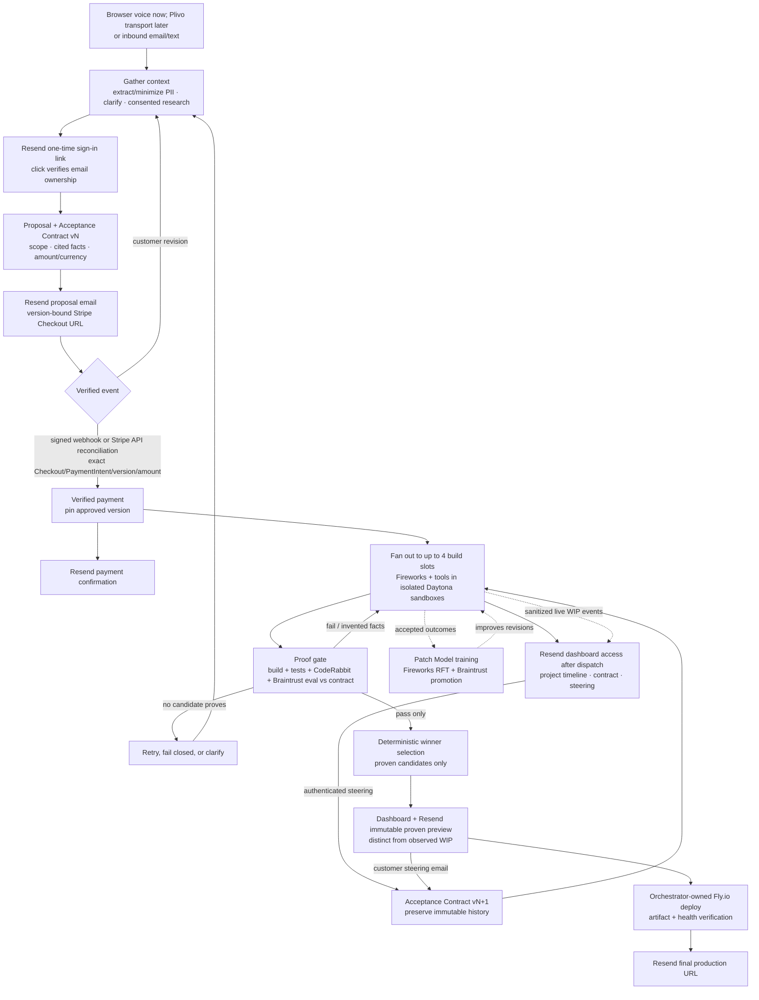

# BuildLabs

**Build anything from a conversation — and prove it before it ships.**

> A prospect talks to BuildLabs's voice agent about the website or application
> they want. That conversation becomes a transcript, the transcript becomes an
> Acceptance Contract, and a durable orchestrator emails a versioned proposal
> and verifies the matching Stripe payment before dispatching parallel build
> agents. Every candidate is built, tested, and evaluated against the contract;
> anything that invents facts or fails a hard requirement is thrown away. Only a
> build that is *proven* against the contract is promoted to an approvable
> preview, deployed to production, and delivered to the customer automatically.
> During construction, the customer can watch a clearly labeled, sanitized WIP
> projection in an authenticated dashboard; observation never counts as proof.

Most AI builders optimize for producing a first draft fast. BuildLabs optimizes
for **proving the result is correct before the customer ever sees it.**

> **Status:** backend implementation in progress. This repository contains the
> isolated four-slot build runtime, proof gate, sponsor adapters, durable
> evidence/outbox storage, internal HTTP API, CopilotKit AG-UI run stream,
> bounded ElevenLabs studio-operation bridges, and the general-orchestration
> boundary described below. The initial dashboard backend slice implements a
> 15-minute fragment-delivered/POST-exchanged login, atomic one-time
> consumption with email ownership verification, a project-scoped signed
> session, bounded signed-capability link reissue with one request family per
> capability digest, a 32-family project cap, at most three delivery
> generations, and bounded optimistic-CAS reload,
> CSRF-protected/idempotent/stale-fenced steering, polling project events,
> sanitized build activity, last-known-good release projection, and a
> content-free pending-login reconciliation index that keeps terminal projects
> recoverable.
> The local Voice Intake workspace reads a bounded ElevenLabs archive on demand
> without a second transcript store and forwards signature-verified completed
> sessions into the protected, idempotent orchestration intake endpoint. Browser
> voice itself, the Next.js/CopilotKit customer UI, SSE, a customer-renderable
> raster WIP gateway, server-side session revocation/logout/renewal, edge rate
> limits, and provider-backed end-to-end proof remain separate work. Production
> deployment and customer delivery still require configured Stripe, Resend,
> Fly.io, and sponsor accounts.
> Today, research capture requires an explicitly authorized caller-owned URL
> (business-name discovery and licensed asset reuse are not wired), and the
> autonomous deploy path supports self-contained HTTP containers; typed
> database/auth/secret/volume provisioning remains implementation work.
> Customer contact PII remains builder-excluded until the field-level
> generated-site approval path is implemented.

---

## 1. What BuildLabs is

BuildLabs is a **conversation-to-delivered-software pipeline**. A caller
describes what they need in plain language; BuildLabs sells the engagement,
captures the requirements and contact details, builds several real candidate
implementations in parallel after verified payment, proves the best one against
an automatically derived contract, **deploys it to production**, and emails the
finished, production URL to the customer — with no human sign-off in the loop.

Three commitments define the product:

- **Anything the caller wants.** Scope is intentionally open: marketing sites,
  lead-gen sites, and full web applications. The voice agent can pitch and take
  an order for any of them.
- **Paid version before building.** A builder receives no assignment until
  Stripe proves the exact agreed proposal version, amount, and currency was
  paid.
- **Proven before delivered.** Customers may observe an authenticated,
  watermarked WIP projection while agents work, but cannot approve, download,
  promote, or receive a candidate as a deliverable until it has passed the
  automated proof gate: it builds, passes its own generated tests, is
  CodeRabbit-clean, matches the Acceptance Contract, and introduces no invented
  business facts.

### The honest caveat on scope vs. proof

Open scope and a strong proof guarantee pull against each other. A constrained
lead-gen site can be verified tightly; an arbitrary application cannot be
auto-verified to the same standard. BuildLabs resolves this by making the proof
gate **adaptive and per-project** rather than a fixed rubric (see §7). The
guarantee is therefore strongest for well-bounded sites and honestly weaker for
open-ended applications — the system reports *what* it proved for each build, not
a blanket "correct."

---

## 2. End-to-end pipeline

Every transition runs the same durable agent cycle:

1. **Gather context** — load the latest transcript/email thread, immutable
   proposal and contract versions, consented research evidence, payment state,
   builder events, and prior verification receipts. Ask the customer for
   clarification instead of guessing when a required fact is absent or
   contradictory.
2. **Take action** — use Fireworks reasoning to select a bounded tool action:
   research, draft a proposal, create Checkout, send email, dispatch builders,
   route a revision, select a proven candidate, deploy, or deliver.
3. **Verify work** — deterministic policy validates the action and its receipt
   before state advances. Model output alone never proves payment, a build, a
   deployment, or an email delivery.
4. **Repeat durably** — persist the new state and events, then wait for the next
   webhook/job. Restarts and duplicate deliveries must not repeat charges,
   builds, deployments, or customer email.

The customer journey is:

1. **Intake** — the browser voice agent, future Plivo voice transport, or an
   inbound email/text captures the requested product, name, email, phone,
   caller-approved own-business research, and an agreed quote. The voice agent
   does not read personal details back or ask the caller to confirm them.
2. **Channel verification** — voice-captured email starts as transcribed,
   not verified. Resend sends a one-time passwordless sign-in link; consuming
   that link proves control of the email address and opens the project
   dashboard. This replaces spoken confirmation without treating ASR confidence
   as identity proof.
3. **Context and proposal** — the orchestrator identifies and protects PII,
   performs only consented research with cited sources, derives an Acceptance
   Contract, and emails proposal version `N` with its version-bound Stripe
   Checkout URL.
4. **Pre-payment revision loop** — an authenticated dashboard prompt or verified
   email reply creates immutable proposal/contract
   version `N+1`; obsolete Checkout Sessions are expired, and a new summary and
   payment URL are sent. The loop continues until requirements are clear and
   payment for one exact version is verified.
5. **Payment gate** — a signed Stripe webhook or authenticated server-to-server
   reconciliation is accepted only after Checkout, PaymentIntent, customer,
   project, proposal version, amount, currency, mode, and paid status all match
   durable expectations. Build work cannot start before this gate. Resend sends
   a receipt/thank-you naming the approved version before dispatch; after the
   complete parallel batch is durably dispatched, a separate durable email
   sends fresh passwordless dashboard access.
6. **Parallel builds and live observation** — the orchestrator creates one
   end-to-end, version-pinned build brief and fans it out to up to four
   independent Fireworks agents in Daytona. The implemented backend projection
   exposes sanitized stages, allowlisted tool activity, and proof counts. The
   target UI adds file/diff summaries and a controller-rendered raster labeled
   `UNVERIFIED WIP`; that visual gateway is not implemented yet and the current
   schema reports `customerRenderable: false`. Neither slice may expose provider
   credentials, raw model reasoning, unrestricted logs, direct Daytona URLs, or
   downloadable WIP artifacts.
7. **Proof and preview** — only candidates that pass every hard proof gate may
   enter deterministic winner selection. The dashboard and email then expose a
   frozen, immutable preview of the selected proven candidate, visually and
   semantically distinct from live WIP observation.
8. **Steering loop** — an authenticated dashboard prompt or verified customer
   email enters deterministic paid-scope classification. An accepted in-scope
   edit becomes Acceptance Contract version `N+1`, is dispatched as a bounded
   change, and must pass the complete proof gate again before a replacement
   preview or deployment. A no-scope acknowledgement creates no false work; a
   commercial expansion returns to proposal and payment.
9. **Production delivery** — when the latest version is proven and has no
   pending steering event, the orchestrator deploys the deterministic winner to
   Fly.io, verifies artifact identity and service health, and uses Resend to
   email the final HTTPS URL automatically.
10. **Learning** — accepted outcomes may feed the opt-in Patch Model training
   pipeline.

---

## 3. Subsystems

Each subsystem has one purpose, a defined input/output interface, and can be
built and tested independently.

### 3.1 Voice intake agent

- **Purpose:** turn an inbound/outbound voice conversation into a complete,
  build-ready transcript — while selling the engagement.
- **Powered by:** **ElevenLabs** (voice + conversational turn-taking) and
  **Fireworks** (the reasoning brain that drives discovery, scoping, and
  negotiation). Built fresh — this does **not** reuse any prior codebase.
- **Behavior:**
  - Opens by pitching a website or application ("we build web applications").
  - Runs discovery: asks progressively deeper questions as the caller describes
    what they want, and determines the scope and any specific elements.
  - **Captures contact info smoothly** — name, email, phone, and any other
    necessary contact details are extracted once without verbal read-back or a
    confirmation turn. The transcript is not identity proof: email ownership is
    verified afterward by consuming the one-time dashboard sign-in link.
  - **Negotiates a quote** — proposes a price, negotiates toward a balanced deal
    if the caller pushes back, and records the agreed amount.
  - **Researches the caller's own business** — if they name an existing business
    or site, looks it up and pulls relevant info and images to inform the build.
    (Consented research of the caller's *own* business, not prospecting.)
  - Aims to close: resolves scope and price before ending while avoiding a
    repetitive personal-detail confirmation script.
- **Output:** a structured backend **transcript** handed to the orchestrator.
- **Transport:** the first surface is browser voice. A future adapter is planned
  to carry the same ElevenLabs/Fireworks conversation through Plivo for PSTN
  calls, but Plivo is intentionally not wired in this repository yet (see §8).

### 3.2 Normalized intake record

- **Purpose:** normalize a voice transcript or inbound email/text into the single
  source of truth for what the customer requested.
- **Contents:** contact info with per-field provenance and verification state
  (email becomes verified only after magic-link consumption; phone remains
  captured unless a separate verification workflow proves it), requested scope and
  elements, caller name, the agreed amount and currency, research consent, and
  any business-research findings (facts, assets, image references, and source
  citations).
- **Interface:** produced by the voice agent or message-ingestion adapter;
  consumed by the orchestrator to derive proposals, build briefs, and the
  Acceptance Contract.
- **PII handling:** intake classifies direct and sensitive identifiers before
  they enter general agent context. Keep only fields needed to fulfill the
  engagement; encrypt them in transit and at rest with separately managed keys,
  enforce project-scoped access, redact logs and Braintrust traces, and apply a
  deletion/retention policy. Models and builders receive opaque project IDs and
  the minimum necessary context. A sandbox receives customer contact data only
  when the customer explicitly approved that exact content for the generated
  product; it never receives billing data or unrelated PII.

### 3.3 Orchestrator

- **Purpose:** the durable backbone that routes a transcript or message through
  proposal, payment, parallel construction, proof, steering, deployment, and
  delivery.
- **Model:** all agentic planning and drafting uses Fireworks serverless
  inference. The durable state machine, authorization rules, signatures,
  monetary checks, contract gates, and idempotency are deterministic application
  code; they are never delegated to an LLM.
- **Loop:** for each event, gather the minimum project context, take one bounded
  action, verify its receipt and policy predicates, persist the transition, and
  repeat. Unknown or unverifiable state fails closed.
- **Interface:** in = transcript, authenticated inbound messages, provider
  webhooks, and builder events; out = versioned proposals/contracts, Checkout
  Sessions, build assignments, proven previews, a deployed site, customer email,
  and complete project state/evidence for the UI.

#### 3.3.1 Context, research, and proposal versioning

- Extract the customer's name and PII into the protected project profile; do not
  duplicate raw PII into prompts, event metadata, research queries, or traces.
- Research only the caller's own business and only with recorded consent. Store
  the URL, title/publisher, retrieval time, and the exact fact or asset each
  source supports. Search results and webpages are untrusted input: cite them,
  scan for prompt injection, and never silently turn an uncorroborated claim
  into an approved business fact.
- If identity, verified email, scope, agreed price, currency, consent, or a hard
  requirement is missing or contradictory, enter `needs_clarification` and ask
  a focused question. A clarification may ask for a missing requirement, but
  the voice agent must not read back name, email, phone, or other personal
  details merely to confirm transcription. Email ownership is established by
  the passwordless link, not by ASR confidence or a spoken "yes." Omit optional
  facts that cannot be verified.
- Each project revision has an immutable, numbered **Acceptance Contract
  version**. Before payment, its customer-facing summary is a same-numbered
  **Proposal version** containing scope, deliverables, approved facts with
  citations, exclusions/unknowns, amount, currency, and a content hash. After
  payment, steering produces a same-numbered immutable change summary while
  retaining the paid commercial parent. A reply never mutates a prior version;
  it creates `N+1` with a recorded parent and change rationale.

#### 3.3.2 Email and mandatory payment loop

- Resend sends one-time dashboard sign-in links, the proposal, payment
  confirmation, post-dispatch dashboard access, proven-preview, clarification,
  and final-delivery messages. The implemented 15-minute capability is signed,
  one-time, bound to one project and normalized email, delivered in the URL
  fragment, removed from browser history, and exchanged only by `POST`. Its
  digest is consumed in the same transaction as the email-ownership event.
  Return paths are allowlisted and the token never enters a request path,
  analytics field, or referrer.
- The current exchange issues a seven-day stateless project-scoped
  `HttpOnly`, `Secure`, `SameSite=Strict` session plus a session-bound
  double-submit CSRF cookie. A failed exchange can present the still-signed
  active or recently expired capability to a generic `202` reissue route; the
  server rechecks its project/email digest, mails only the protected stored
  address, and applies a durable one-minute project send floor. Reissue grace is
  bounded to 30 days.
- Reissue is bounded at every durable layer. One signed capability digest can
  create only one `send_dashboard_login` request family, so replaying it never
  queues a second replacement. A project can retain at most 32 distinct request
  families. If provider delivery does not complete before a link's 15-minute
  expiry, that family may rotate, but every passwordless-link family is capped
  at three delivery generations; exhaustion fails closed. Creating a request
  family retries an optimistic conflict by reloading protected state at most
  three times.
- Dashboard-login delivery recovery is attributed to that exact effect and
  honors its own `nextAttemptAt`; an unrelated due effect cannot cause an early
  login retry or spend its retry budget. SQLite schema v6 maintains only a
  content-free `has_pending_dashboard_login` bit, recomputed on aggregate saves
  and backfilled from encrypted aggregates during migration. The reconciliation
  scan includes this bit independently of lifecycle status, so a terminal
  project remains pollable until its pending login mail completes or fails.
- The production target remains a rotated server-side grant with revocation,
  logout, session renewal, a generic email-entry request flow, and edge-wide
  rate limiting; do not call the present session production-complete until those
  controls exist.
- Preserve the email thread with provider message
  IDs (`Message-ID`, `In-Reply-To`, and `References`) and an opaque,
  project-scoped reply token. Verify inbound-provider signatures and sender
  identity before treating a reply as steering. Sender identity must come from
  cryptographic verification of the raw message (for example aligned DKIM), not
  a caller-supplied `Authentication-Results` header. Sanitize quoted content and
  attachments as untrusted input.
- Every proposal email explains what will be built, what remains unknown, the
  exact price/currency/version, how to request changes by replying, and includes
  a server-created **Stripe Checkout Session URL** bound to that immutable
  version. It must not expose unnecessary PII in the URL or Stripe metadata.
- A pre-payment edit creates version `N+1`, expires the prior open Checkout
  Session where possible, and sends a replacement proposal and Checkout URL.
  Payment for an obsolete version never authorizes building a newer version.
- **Payment is mandatory before any build dispatch.** Do not trust a success
  redirect, browser callback, screenshot, email claim, or LLM interpretation.
  Verify the Stripe signature over the raw webhook body, deduplicate the Stripe
  event ID, require a successful paid event, and compare the Checkout
  Session/PaymentIntent customer-project binding, proposal version, amount, and
  currency to durable expectations. Re-fetch from Stripe during reconciliation
  when needed.
- After verified settlement, pin the paid proposal/contract version and send a
  payment confirmation naming that version, thanking the customer, explaining
  how email or dashboard prompts create revisions, and promising dashboard
  access after dispatch plus a proven preview. The separate access email is
  queued only after every assignment in the exact paid batch is durably
  dispatched. An in-scope steering request after payment creates contract
  version `N+1`; a request that changes commercial terms returns to
  proposal/Checkout for the additional or replacement agreed amount before the
  expanded work starts.

#### 3.3.3 Builder dispatch, proof, preview, and steering

- Generate one complete, end-to-end build brief pinned to the contract version
  and content hash. Include approved facts and citations, hard requirements,
  preferences, forbidden claims, assets, verification plan, and required
  artifacts; exclude billing details and unnecessary contact PII.
- Allocate from one to four generic build slots according to capacity and policy.
  Each assignment is independently isolated and carries the same immutable
  contract version. Track its run, sandbox, artifact digest, evidence,
  Braintrust trace, and terminal event.
- Raw Daytona preview URLs, sandbox identifiers, unrestricted logs, provider
  payloads, shell credentials, and WIP artifacts remain **operator-only**. The
  current authenticated customer boundary shows allowlisted durable activity
  from that customer's project; a future gateway may add a
  controller-rendered, sanitized raster. Every WIP surface is labeled
  `UNVERIFIED WIP`, is non-downloadable, carries no approval/deploy action, and
  may disappear or regress as agents work.
  A customer **preview** may be created only from a frozen candidate whose exact
  artifact and contract version passed the full proof gate. Its URL remains
  pinned to that immutable snapshot; later WIP cannot alter what it shows.
- The proven-preview email names the contract version and what the automated
  gate verified, explains that the link is a frozen review artifact, and invites
  the customer to reply in-thread with steering. It must not imply that
  unverified changes appear live; each reply produces a newly proved preview.
- An authenticated steering email or dashboard prompt enters the same
  orchestration command boundary and paid-scope classifier. Accepted in-scope
  work creates immutable Acceptance Contract version `N+1` plus an explicit
  change brief; commercial expansion returns to a new payment gate. Dashboard
  text never invokes a sandbox tool directly. In-flight work for an older
  version may be retained as evidence but cannot become the latest deliverable.
  Re-run the complete build/test/review/fact gate for the cumulative new
  contract before sending another preview or deploying.
- Select among **proven candidates only** using a versioned deterministic ranking
  policy: compare the recorded preference/quality score tuple, then apply a
  stable candidate-ID tie-breaker. Wait for the configured candidate barrier or
  deadline. An LLM may supply scored evidence but cannot override a hard gate or
  choose an unproven candidate.
- The orchestrator, never a sandbox, deploys the selected artifact to Fly.io.
  Before final email it revalidates run/version/artifact identity, verifies the
  deployed image/digest and HTTPS health check, and records the production URL.

#### 3.3.4 Durability, idempotency, and failure states

- Store every project state transition, immutable version, inbound event,
  verification receipt, and correlation ID durably. Use a transactional webhook
  **inbox** plus **outbox**: provider events are processed at least once but
  effects are deduplicated by provider event ID and aggregate/version key.
- Use stable idempotency keys for Stripe Session creation, Resend sends, builder
  dispatch, proof consumption, Fly.io deploys, and final delivery. State changes
  use optimistic concurrency/compare-and-set so concurrent email, payment, and
  builder events cannot skip gates or send duplicates.
- Transient provider failures enter a retryable state with bounded exponential
  backoff; exhausted work is dead-lettered and shown to the operator. Permanent
  or policy failures enter an explicit terminal/attention state, retain their
  evidence, and emit no downstream action.
- Required states include `needs_clarification`, `awaiting_customer_revision`,
  `awaiting_payment`, `payment_verification_failed`, `paid`, `building`,
  `verifying`, `no_proven_candidate`, `preview_ready`, `revision_pending`,
  `deploying`, `deployment_verification_failed`, `delivering`, `completed`, and
  `needs_operator_attention`. A state name never substitutes for its underlying
  verification receipt.
- Invalid webhook signatures are rejected and security-audited. Expired/canceled
  Checkout remains unpaid. If no candidate proves after bounded repair/retry,
  request clarification or stop in `no_proven_candidate`. If deployment health
  fails, retain the last known-good release and do not send a final URL. If email
  permanently bounces, stop in a contact-attention state rather than claiming
  delivery.

### 3.4 Build agents (four slots)

- **Purpose:** actually construct the software.
- **Model:** the orchestrator owns a pool of **four generic build slots** and
  allocates them dynamically. Each slot is an autonomous coding agent with
  **Fireworks** inference plus **bash and file tools**, working inside its **own
  isolated Daytona builder sandbox**. Multi-step tool trajectories preserve Fireworks
  interleaved reasoning in memory for the next model turn, while never writing
  raw reasoning to Braintrust or durable logs. Opaque per-run cache-affinity
  keys isolate prompt caching by project, and bounded latency/token/cache metrics
  are attached to the trace.
- **Behavior:** writes code, runs the build, starts the dev server, iterates, and
  **emits a `Dockerfile`** so the result deploys through one uniform path. Each
  sandbox is shown **live in an operator web-view pane**, so the operator can
  watch the site being built and inspect its raw **preview URL** in real time.
  That URL is not customer-safe until its frozen artifact proves.
- **Bounded completion:** `maxAgentSteps` remains the assignment's hard
  model-turn cap (60 by default). A bounded finalization window inside that cap
  tells the agent to stop optional work, validate, start the latest preview, and
  hand off. The final turn exposes only `start_preview` or `finish`. If the cap
  is reached after a preview started successfully, the controller records a
  `budget_exhausted_handoff` in the Braintrust trace and sends the frozen
  revision to independent verification; `finish` certifies nothing. Exhaustion
  without a successful preview remains a fail-closed agent-step-limit error.
- **Review loop:** the controller runs
  **CodeRabbit's official headless CLI in agent mode** against each frozen
  candidate. Findings feed the same agent's bounded repair loop before the next
  proof attempt, so CodeRabbit participates in-loop as well as in the final
  review. The controller, not candidate code, supplies a deterministic
  Acceptance-Contract policy capsule through CodeRabbit's official `--config`
  option; candidate-authored review control files are rejected, and the policy
  digest is stored with the review receipt. Explicit throttling and a missing
  terminal completion receive at most three attempts with 15/30-second
  backoff; permanent or mixed protocol failures stop immediately, and retry
  exhaustion blocks proof. CodeRabbit consumes MCP servers but does not publish
  an official CodeRabbit MCP server; the product must not fabricate one.
- **Independent proof topology:** the builder never certifies its own workspace.
  The controller validates the frozen Git export, computes a canonical digest
  over the exact controller-held paths, modes, and bytes, then hydrates **two
  fresh Daytona verifiers** from that same attested source. The command verifier
  runs the host build, tests, forbidden-claim scans, and contract commands. A
  separate untouched delivery verifier builds the Docker image, serves the
  preview, supplies CodeRabbit and Fireworks evaluation input, and creates the
  accepted snapshot/artifact. This prevents generated or ignored builder files
  from seeding the delivery image. Each sandbox gets a bounded 120-second Docker
  readiness window with redacted daemon-exit diagnostics. A Docker-runtime
  initialization failure is deleted synchronously and retried once in a fresh
  sandbox before reporting an unreclaimed resource. The builder and command
  verifier are deleted; only a passing delivery verifier is promoted as the
  candidate preview.
- **Preview hosting:** the running site is served from its **Daytona
  sandbox/preview** — ephemeral, for building and comparison. Production hosting
  is separate (§4).
- **Isolation:** sandboxes are isolated precisely so a build can install whatever
  packages it needs without risk. **No production credentials — including the
  production deploy token — ever enter a sandbox.**

### 3.5 Studio and customer dashboard (CopilotKit)

The browser product has two explicitly separate authorization views over the
same durable truth. Neither client invents progress, provider health, proof, or
agent activity.

#### Operator studio

- Shows the job queue, protected project evidence, four raw live web-view panes,
  contract cards, candidate comparison, live diffs, component tree, provider
  operations, dead letters, and direct ephemeral WIP links.
- Supports bounded ElevenLabs spoken operations. The current studio subagent can
  read candidate state/evidence and request a compare-and-set cancellation; the
  read response mints a two-minute controller-signed capability bound to the
  run, opaque conversation correlation, status, and revision. Cancellation also
  requires ElevenLabs' marked `system__conversation_history`, and the controller
  verifies that the latest user turn explicitly requests cancellation.
- Uses the internal authenticated **AG-UI** endpoint, which replays durable run
  events and state snapshots to CopilotKit. Raw conversation text, model
  reasoning, bearer material, and credentials are never traced or copied into
  durable events.

#### Customer dashboard

The bullets below define the complete target. The repository currently
implements the passwordless exchange, project-scoped signed session,
bounded signed-capability reissue and terminal-project mail recovery,
double-submit CSRF, polling project/event APIs, safe run projection, and shared
steering command boundary. It does not yet include the frontend, SSE, raster WIP
gateway, opaque customer aliases, server-side session
revocation/logout/renewal, or provider-backed end-to-end verification.

- Passwordless email login opens only projects bound to that normalized,
  verified email. Sessions are project-scoped, short-lived, revocable, CSRF
  protected, and never interchangeable with the operator or provider tokens.
- The first screen is the actual project workspace, not a landing page: current
  contract/version and payment state, a four-slot build cockpit, an event
  timeline, latest proven review, final delivery, and one steering composer.
- Each slot has stable dimensions and shows truthful stage, status, elapsed time,
  last allowlisted tool category, changed-file/diff summaries, validation and
  proof progress, and a controller-rendered WIP raster when available. The
  current API implements stage/tool/proof activity only. Provider outages or
  missing telemetry display `unavailable` or `awaiting events`, never simulated
  activity.
- WIP and proven states must be impossible to confuse. Live panes use a persistent
  `UNVERIFIED WIP` banner and disable approval, download, and deployment. A
  frozen proven preview identifies the exact contract version, artifact digest,
  proof summary, and review expiration. The final production URL identifies the
  verified Fly release.
- Steering entered in the dashboard is a typed, idempotent customer message
  command. It goes through gather, action, verify, immutable contract versioning,
  paid-scope policy, and the complete proof gate exactly like authenticated email
  steering. The UI never sends commands directly to Fireworks or Daytona.
- The implementation contract for this surface lives in
  [`CUSTOMER_DASHBOARD_SPEC.md`](./CUSTOMER_DASHBOARD_SPEC.md).

### 3.6 Acceptance Contract

Described in detail in §6.

### 3.7 Proof / evaluation gate

Described in detail in §7.

### 3.8 Delivery

- **Purpose:** get the proven result to the customer.
- **Final artifact:** the **production URL** (the site running on Fly.io), not the
  ephemeral Daytona preview.
- **Channel:** **email via Resend** — proposal, payment confirmation, immutable
  proven preview, revision responses, and final production URL remain in one
  correlated customer thread. The final URL is sent automatically only after
  the latest contract passes proof and the Fly.io deploy is independently
  verified. It names the delivered contract version, links to the recorded proof
  summary, and explains that future replies can begin another versioned
  iteration. No human sign-off is required.
- **Payment:** a version-bound Stripe Checkout payment for the agreed amount and
  currency is a mandatory pre-build gate (§3.3.2), not an optional deploy gate.

### 3.9 Patch Model training (Fireworks RFT)

- **Purpose:** a specialized model that makes revisions and bug-fixes precisely.
- **Job (narrow):** *given an existing project, its Acceptance Contract, test
  failures, and one requested change, produce the smallest safe code change that
  satisfies the request without breaking anything else.*
- **Training examples:** the contract, current project state, requested change,
  proposed patch, Daytona build/test results, Braintrust evaluation, and whether
  the result was accepted.
- **Verifiable reward:** did it build? did tests pass? was the change completed?
  were prior requirements preserved? any accessibility/performance regression?
  was the patch oversized? did it introduce unsupported business claims?
- **Promotion:** **Braintrust** compares a trained checkpoint against the base
  model on a held-out set; a checkpoint is promoted only on measured improvement.
  **Fireworks improves the model; Braintrust proves the improvement is real.**
- **Data governance:** opt-in, anonymized structural examples only; customer data
  is **not** mixed across projects.
- **Repository boundary:** this section defines the product's training and
  promotion pipeline. The current build-agent backend implements an explicit
  consent gate, keyed project pseudonyms, structural-only curation, deterministic
  reward from controller evidence receipts, task-group-stable train/held-out
  partitioning, and separate bundle-scoped, version-pinned Braintrust datasets.
  A domain-separated controller HMAC first attests each bundle's recomputed
  content digest, project scope, curation policy, and consent-receipt digests.
  Another binds each result to its project, exact dataset ID/version/bundle,
  base-or-candidate role, Fireworks model resource, case, output, reward, and
  evidence. The adapter verifies the bundle and result attestations plus the
  reopened Braintrust dataset identity before it creates an experiment. Keyed
  case IDs in experiment input prevent structurally identical examples from
  collapsing into one comparison row. The resulting comparison is also signed;
  the manual eligibility function rejects unsigned or altered comparisons.
  Only then can a measured terminal improvement, no score regressions, and
  enough held-out cases yield **manual-promotion eligibility**. The HMAC key
  remains controller-local. The provider payload contains counts, enums, and
  keyed digests — never source, diffs, paths, commands, stdout, transcripts,
  business facts, customer identifiers, raw model output, or signing material.
- **Still unconfigured:** these structural records are evaluation and governance
  artifacts, not a usable Fireworks patch-generation dataset. This repository
  does **not** emit Fireworks training `messages`, expose an Eval Protocol remote
  `/init` rollout service, upload an evaluator/dataset, create an RFT job, or
  promote/deploy a checkpoint. Those steps remain blocked until a genuinely
  useful anonymized code representation and customer-controlled rollout
  environment are implemented and reviewed. No code path auto-promotes a model.

---

## 4. Tech stack

The hosting/deploy path is settled; other choices are recommended defaults and
easy to change.

### 4.1 Platform (BuildLabs itself)

| Layer | Choice | Notes |
| ----- | ------ | ----- |
| Studio / customer dashboard | **Next.js (React) + CopilotKit + Tailwind** | Role-separated operator and project-scoped customer views over durable events, contracts, diffs, steering, and four live panes. |
| Orchestration & agents | **TypeScript / Node** | Durable state machine and typed provider boundaries; all agentic reasoning/drafting goes through Fireworks. |
| Inference | **Fireworks AI** | OpenAI-compatible API: reasoning, code-gen, and the trained Patch Model. |
| Sandboxes | **Daytona SDK** | One sandbox per build slot; raw WIP URLs remain operator-only, while customers receive a sanitized authenticated WIP projection and frozen proven previews. |
| Evaluation / tracing | **Braintrust SDK** | Candidate scoring, the automated gate, experiments, Patch Model promotion. |
| Voice | **ElevenLabs** | Intake-call voice + studio edit voice; Fireworks does the reasoning. |
| Code review | **CodeRabbit headless CLI (`cr review --agent`)** | Controller-side review per candidate; findings feed bounded in-loop repairs and critical findings block proof. |
| Email | **Resend** *(non-sponsor)* | Versioned proposal, confirmation, proven-preview, revision, and final-delivery threads with signed inbound event handling. |
| Payments | **Stripe Checkout** *(non-sponsor)* | Mandatory version-bound payment before build dispatch; signed webhooks or authenticated reconciliation plus exact Checkout/PaymentIntent/customer/amount/currency/version verification. |

### 4.2 Generated apps

- Every build **emits a `Dockerfile`**, so any stack deploys through one path.
- **Default:** Next.js for web apps; static (Next static export / plain HTML) for
  simple marketing sites; a managed **Postgres** (Neon, Supabase, or Fly Postgres)
  when the app needs persistence.

### 4.3 Hosting & the deploy pipeline

Three distinct stages — do not conflate them:

- **Observation (during build) -> Daytona.** Each sandbox runs the app live. The
  operator may open the raw ephemeral URL; a customer can currently see only
  authenticated, allowlisted activity. A sanitized controller-rendered
  `UNVERIFIED WIP` raster remains target work. Observation is never an
  approvable preview.
- **Review preview (after proof) -> Daytona frozen snapshot.** A customer
  preview is created only from the exact frozen snapshot that passed the full
  proof gate.
- **Production (after the proof gate) → Fly.io.** The **orchestrator** deploys the
  winning container to Fly.io and receives a real, always-on **HTTPS production
  URL**. This URL is the final artifact.

**Why Fly.io** (chosen over Vercel/v0, which stay excluded):

- **Docker-native** — matches the `Dockerfile` artifact; any stack deploys the
  same way.
- **Cleanest unattended deploy** for an agent: an org-scoped deploy token
  (`fly tokens create org`) creates dynamic per-project apps, while an
  app-scoped deploy token can deploy an exact pre-provisioned app;
  `flyctl deploy --remote-only` and the REST **Machines API** require no human
  in the loop.
- **Cheap + scale-to-zero:** usage-based (~$2/mo for a small app); idle delivered
  sites cost almost nothing, yet the URL stays real and always-on.

**Fallbacks / alternatives considered:** **Render** has a true $0 free tier but
sleeps after 15 min of inactivity (~1 min cold start) — kept only as a demo
fallback where $0 beats always-on. **Railway** has excellent DX but no free tier.
**Kuberns** (AI-native auto-deploy, no Dockerfile) is worth watching but newer.

### 4.4 The credential boundary

The build agent produces the artifact (app + `Dockerfile`); the **orchestrator**
holds the production deploy token and required Fly organization slug, creates
or recovers the exact derived app idempotently, and performs the deploy after
the proof gate passes. Dynamic app creation requires an org-scoped token;
app-scoped tokens are retained only for exact pre-provisioned apps.
**Production deploy credentials never enter a build sandbox.**

---

## 5. Sponsor architecture

Six sponsors, each load-bearing. WorkOS has been dropped: operator access and
project-scoped passwordless customer sessions are separate application-owned
boundaries rather than a general multi-tenant identity platform. Fly.io and
Resend are non-sponsor infrastructure (§4).

| Sponsor | Responsibility in BuildLabs | What the judges see |
| ------- | ---------------------------- | ------------------- |
| **Daytona** | One isolated builder per slot plus two controller-created verifiers hydrated from one content-attested export. The command verifier runs host checks; the untouched delivery verifier builds the container, then activates Daytona's persisted [`networkBlockAll`](https://www.daytona.io/docs/en/network-limits/) outbound firewall before starting or rendering it. The seal is reapplied after a snapshot restart, and only that sealed delivery verifier can become the accepted snapshot/preview. Its pinned v2 snapshot runs Playwright against Chromium with same-origin traffic only. From the root and controller-issued HTTP paths it performs a deterministic frozen-DOM BFS capped at 32 routes, classifies actual non-HTML responses, and inspects bounded vertical viewport tiles across every HTML page. It replays a bounded graph of up to 15 visible controls from fresh page loads: controller-owned values drive normal forms one field at a time before prevented submit, every bounded select/radio/checkbox alternative is sampled, same-page fragment links are clicked, authored CSS hover/focus states are inspected terminally, and explicit handler-driven hover/focus states must produce a semantic transition before continuing through the graph. A child reuses a parent's pixel proof only when tile offset, dimensions, candidate geometry, and PNG bytes match exactly; receipts emit duplicate visible-text states and tile digests once. Initial WebSockets and every HTTP/WebSocket attempt after load fail the route; no aborted loading state can count as proof. HTTP text counts only when computed layout, clipping, stable paint reachability, contrast, and effective opacity make it visible; all tile digests are bound into the receipt and bounded PNG bytes stay controller-only for visual inspection. Uninspectable canvas/media/frame surfaces, embedded data/blob imagery, generated pseudo-element content, JavaScript anchors, unsupported form controls, unobservable stateful actions, unexplored or oversized interaction graphs, crawl overflow, and oversized documents fail closed. Sandboxes carry run/project/candidate/role labels for [OpenTelemetry](https://www.daytona.io/docs/en/observability/otel-collection/), and the SDK is disposed on shutdown. [Process isolation](https://www.daytona.io/docs/en/process-code-execution/) · [Snapshots](https://www.daytona.io/docs/en/snapshots/) | Up to four real builds are visible live, while the proof record shows that builder side effects, post-build egress, hidden, below-fold, hover/focus/click-revealed claims, unlisted reachable routes, and transient background pixels could not contaminate delivery. |
| **Fireworks AI** | Every reasoning and code-generation model: the voice agent's brain, the general orchestration agent, the build agents, and the trained **Patch Model** for revisions. Tool trajectories use [interleaved reasoning](https://docs.fireworks.ai/guides/reasoning) plus isolated [prompt caching](https://docs.fireworks.ai/guides/prompt-caching); RFT remains the training path. [RFT](https://docs.fireworks.ai/fine-tuning/how-rft-works) | The conversation, orchestration decisions, generated code, and patches run on Fireworks; trace metadata shows bounded model latency/cache/token performance without exposing reasoning. |
| **Braintrust** | Traces every decision/tool-call/revision; scores candidates; is the automated **evaluation gate**; runs offline experiments; gates Patch Model promotion. Fireworks token, cache, time-to-first-token, and processing telemetry become native metrics; voice turns use content-free custom model/tool spans with fail-closed flushing. [Advanced tracing](https://www.braintrust.dev/docs/instrument/advanced-tracing) · [Evaluate](https://www.braintrust.dev/docs/evaluate) | A quality scoreboard and a trace explaining exactly why a candidate was rejected, plus provider performance and voice-operation provenance without private reasoning or transcripts. |
| **ElevenLabs** | Voice + conversational AI for the intake agent, and embedded voice for spoken edits in the studio. The backend supports authenticated [Speech Engine](https://elevenlabs.io/docs/overview/capabilities/speech-engine) sessions, server-minted WebRTC conversation tokens, and bounded [webhook tools](https://elevenlabs.io/docs/eleven-agents/customization/tools/webhook-tools). | A caller (or operator) talks, and the product actually runs a permitted workflow rather than producing a chat-only reply. |
| **CopilotKit** | The role-separated studio and customer workspace: contract cards, candidate comparison, live diffs, component tree, steering, and the four live panes. The backend streams honest run state using official [AG-UI events](https://docs.copilotkit.ai/ag-ui/sdk/js/core/events). | A controlled, interactive interface driven by durable candidate events, not a generic chatbot or invented progress. |
| **CodeRabbit** | The official headless CLI reviews every frozen candidate in agent mode under a controller-owned contract policy; findings feed **in-loop bug fixing**, and critical findings or a missing policy digest block proof. [CLI reference](https://docs.coderabbit.ai/cli/reference) · [Code guidelines](https://docs.coderabbit.ai/knowledge-base/code-guidelines) | Real structured findings, bounded repair rounds, the exact policy digest, and a final clean status. |

If any of the six were removed, a necessary part of the product would stop
working.

---

## 6. The Acceptance Contract

Before payment and builds, the orchestrator turns the transcript into an
immutable, versioned **Acceptance Contract** paired with its proposal — the
machine-checkable definition of "done" for this project. The paid version is
pinned to every build assignment and proof receipt. Each accepted email revision
creates a child version and must be proved in full. It contains, as applicable to
the requested scope:

- Approved business facts (only what the caller stated or what research
  confirmed)
- Required pages / screens / functionality
- Requested elements and brand/visual direction
- Forbidden claims (things the site must **not** assert)
- Required calls to action and forms, and where they submit
- Accessibility, performance, and mobile requirements

Every requirement is labeled:

- **Hard requirement** — the build cannot ship without it.
- **Preference** — used to rank otherwise-valid candidates.

Because scope is open, the contract is **derived per project** rather than fixed.
A beautiful build cannot compensate for inventing a fact the caller never stated.
**Hard-requirement failures are never averaged away by design scores.**
Semantic verifiers are ranking-only; every hard requirement must have a
deterministic command or rendered-HTTP verifier.

---

## 7. The proof gate (adaptive)

A candidate is **proven** only when all of the following pass:

1. **It builds twice from one content-attested revision** — host build/tests run
   in a fresh command verifier, while a separate clean delivery verifier builds
   the Docker image without inheriting generated builder output.
2. **Its configured project tests pass** — these candidate-owned test files are
   build evidence, not independent acceptance proof. Contract requirements are
   gated separately by controller-issued command or rendered-HTTP verifier
   receipts. Rendered HTTP evidence comes from the clean Daytona delivery
   verifier's Chromium-computed visible text, never HTML source or a regular
   expression. A future controller-attested acceptance-test bundle is not
   implemented in this backend.
3. **CodeRabbit is clean** — no critical findings (security, accessibility, form
   handling, generated-code slop, project rules). The controller policy treats
   every business claim absent from approved facts as critical, independently
   of the deterministic scan and Fireworks evaluation.
4. **It matches the Acceptance Contract** — every hard requirement satisfied.
5. **No invented business facts** — deterministic forbidden-claim scans plus a
   Fireworks evidence-grounded evaluator reject unsupported assertions. A
   separate Fireworks vision gate also examines the exact bounded PNG tiles
   produced by the clean Chromium verifier plus supported static raster files.
   It runs even when the explicit forbidden-claim list is empty, because visible
   artwork can introduce an assertion absent from both source text and approved
   facts. Every ordered tool result is bound to the source and model-input
   digests; matches, unsupported assertions, unreadable text, malformed output,
   and provider failures block proof. Receipts and Braintrust spans retain only
   digests, indices, counts, statuses, and bounded error codes — never image
   bytes, OCR text, business statements, or raw provider responses.
   A one-frame compositor race after the text differential may use at most four
   paint-spaced recaptures; acceptance requires two consecutive byte-exact
   matches to the original PNG. Persistent drift remains a proof failure and
   reports numeric deltas only.
   Every evaluator PASS must cite controller-issued evidence specific to each
   requirement verifier; an arbitrary valid citation cannot satisfy another
   requirement. Braintrust records the inline scores and complete trace durably
   before a candidate can become deployable.

The gate is **fully automated** — there is no human approval step. Only after it
passes does the orchestrator deploy to production and email the URL. "Proven"
therefore means "passed these automated checks," and the system records *what*
was verified for each build. For open-ended applications the set of checkable
requirements is smaller, and the delivered proof is reported honestly rather than
overstated.

Each proven event carries its Braintrust preference score. The general
orchestrator waits for the configured candidate barrier/deadline, ranks only
those that passed all hard gates with a versioned deterministic score tuple and
stable tie-breaker, and deploys the top one. A preference score can rank passing
candidates but can never offset a hard failure.

A mutable Daytona sandbox URL is not proof and must never be sent to a customer.
The operator may inspect raw WIP in the studio. A customer-facing preview must be
materialized from the exact frozen artifact/version recorded by a
`candidate.proven` event. Any steering request creates a new contract version and
invalidates the older version as the latest deliverable until the new version is
proved.

### 7.1 Build-agent backend boundary

The build-agent subsystem implements one candidate assignment per run. The
general orchestrator
submits up to four assignments for a project; the scheduler gives each an
independent Fireworks agent and Daytona builder. Proof then uses two fresh
verifiers hydrated from the same controller-attested source. The canonical
source-content digest, rather than a builder-reported commit ID, identifies all
receipts, evaluation, artifact, snapshot, and outbox data. A successful run
emits one transactional `candidate.proven` outbox event containing that exact
revision, source artifact, delivery-verifier snapshot, Braintrust trace/ranking
data, and preview coordinates. The source artifact is exposed through an authenticated,
backend-relative `/v1/build-runs/:runId/artifacts/:artifactId` URL and is
revalidated for run identity, size, and SHA-256 integrity when downloaded.
Fly.io deployment, Stripe payment handling, and Resend messaging remain
orchestrator responsibilities and never run inside a sandbox.

The builder defaults to Fireworks' coding-focused Kimi K2.7 Code model, while
short Studio turns use the low-latency Kimi K2.6 Turbo router; builder, Studio,
evaluator, and vision roles remain independently configurable. The vision role
defaults to [Kimi K2.6](https://fireworks.ai/models/fireworks/kimi-k2p6) and
uses Fireworks' OpenAI-compatible
[multimodal `image_url` data-URI input](https://docs.fireworks.ai/guides/querying-vision-language-models)
with a forced structured tool call. Requests contain
at most 16 assets and stay below 8 MiB of base64 data. APNG, GIF, TIFF, animated
WebP, and sequence-branded AVIF/HEIF inputs fail closed instead of inspecting
only an initial frame; supported static WebP/AVIF/HEIF pixels remain covered by
the renderer's PNG tiles without decoding untrusted images in the
credential-bearing controller. Readiness validates the
actual structured tool-call capability of every configured model instead of
assuming that a paginated model catalog is complete. Agents can create an
initial scaffold through one bounded multi-file tool call, and every completed
tool call is persisted as a bounded progress event. On restart, interrupted
runs fail closed and their recorded Daytona sandboxes are deleted; failed
cleanup is retried on later starts.
Fresh command verifiers scan only shipped tracked source for forbidden claims
before any candidate command runs, report bounded path/line diagnostics, and
restore Node dependencies only from one supported root frozen lockfile with
lifecycle scripts disabled. Nested package roots and mixed root lockfile
families are rejected; pnpm and Yarn require an exact `packageManager` version.
Builder instructions forbid those literals in tests, fixtures, comments, and
documentation as well as application code; negative tests must prove supported
output without embedding or encoding a forbidden phrase.
The generated root lockfile body is excluded from semantic evaluator context,
while the frozen revision and required bootstrap receipt continue to bind its
exact bytes. Application source is never silently truncated; exceeding a source
inspection bound fails the run. That bootstrap is a required proof receipt.

The same authenticated backend exposes:

- `POST /v1/integrations/copilotkit/agent` for SSE or protobuf AG-UI state,
  activity, durable event replay, contract/progress/proof summaries, cursor
  continuation, keepalives, and terminal completion. Replay is reconstructed in
  256-event pages; the REST event endpoint exposes bounded `limit`,
  `nextAfter`, and `hasMore` pagination. Unsupported interrupt resumes are
  rejected and concurrent observer streams are bounded.
- `POST /v1/integrations/probe` for a bounded, single-flight deep sponsor probe
  with a short cache. Public `GET /ready` performs no provider I/O and reports
  local configuration only; `GET /v1/integrations` exposes the latest cached
  provider states using `unconfigured`, `configured`, `healthy`, and
  `end-to-end-verified` boundaries.
- bounded ElevenLabs candidate-state, evidence-summary, and compare-and-set
  cancellation tools under `/v1/integrations/elevenlabs/tools/*`. Mutations
  require a fresh controller-signed read capability plus provider-marked
  `system__conversation_id` and `system__conversation_history`; durable
  provenance contains a closed reason code rather than free-form speech or
  bearer material.
- a server-only, internal-authenticated WebRTC token endpoint at
  `/v1/integrations/elevenlabs/webrtc-token`; the ElevenLabs API key never
  reaches the browser.
- an optional ElevenLabs Speech Engine WebSocket attachment at
  `/v1/integrations/elevenlabs/speech-engine` when both the API key and a remote
  engine ID are configured.

These are backend integration surfaces, not claims that the browser studio,
public WebSocket deployment, or provider-side Speech Engine resource is already
live.

---

## 8. Deferred decisions (deliberately not wired yet)

These are intentional gaps, not oversights. Do not implement them until chosen.

- **Plivo PSTN adapter** — browser voice is the first intake surface and
  ElevenLabs/Fireworks own the conversation. A later transport adapter will
  carry that same normalized intake contract through Plivo; no Plivo dependency,
  webhook, or credential is wired yet.
- **General multi-tenant identity** — WorkOS remains dropped. The implemented
  target is narrower: separate operator auth plus application-owned,
  project-scoped passwordless customer sessions.
- **No prior-codebase reuse** — BuildLabs is built fresh. Earlier projects
  (including BuildStax) are **not** to be reused or copied.

> **Now decided (no longer deferred):** hosting, payment, and customer
> observation. Raw Daytona URLs remain operator-only; authenticated customers
> can watch a sanitized `UNVERIFIED WIP` projection, but only a frozen, proven
> snapshot becomes a review preview. Production runs on **Fly.io**; the
> dashboard and emailed **production URL** identify the final artifact.
> **Stripe Checkout payment is mandatory before builds.** Vercel and v0 remain
> excluded.

---

## 9. The demo

Use a hypothetical company, **Mission Peak Electric**.

1. A caller reaches the **voice agent**. They say they install EV chargers and
   electrical panels in Fremont, Newark, and Union City, and want customers to
   request estimates. The agent asks discovery questions, captures name, email,
   and phone without reading them back, records consent to research their own
   business, agrees an amount and currency, and looks up the business for cited
   details/images.
2. The conversation ends; a **transcript** is written. Resend sends a one-time
   link whose consumption verifies email ownership and opens the project
   dashboard.
3. The **orchestrator** derives proposal and **Acceptance Contract v1**, then
   Resend emails the cited summary and a v1-bound Stripe Checkout URL.
4. A requested change produces immutable v2 and a replacement Checkout Session.
   Authenticated Stripe evidence proves the exact v2 amount/currency was paid; the
   orchestrator sends a confirmation and only then releases build work.
5. Up to **four build slots** spin up in **Daytona sandboxes**. The customer
   dashboard shows four truthful stages, allowlisted activity, and sanitized
   `UNVERIFIED WIP` renders; raw URLs and unrestricted output remain
   operator-only.
6. **Braintrust** rejects a candidate that invented "24/7 emergency service,"
   while **CodeRabbit** feeds issues into bounded repair.
7. The orchestrator deterministically ranks only the proven candidates and the
   dashboard plus Resend expose a frozen, proven preview. A customer dashboard
   prompt or verified email reply creates contract v3, which is built and proved
   again before replacing the preview.
8. The latest proven winner is **deployed by the orchestrator to Fly.io**. After
   digest and health verification, the production URL is auto-emailed to the
   caller. Open it, submit an estimate request, and see it captured.

The payoff: BuildLabs didn't just generate something attractive — it delivered a
**proven, production-hosted result** from a phone conversation, automatically.

---

## 10. Boundaries

**In scope:** browser voice intake, a future Plivo PSTN transport adapter, email
delivery, the passwordless customer dashboard, consented research of the
caller's own business, and automated production deploys.

**Guardrails that still hold:**

- **No invented business facts** — the core of the proof guarantee.
- **No prospecting.** Researching the caller's *own* business at their request is
  fine; scraping third parties to find or target prospects is not.
- **No production credentials inside sandboxes.** Sandboxes are isolated so builds
  may install what they need; they never hold real secrets, and the **production
  deploy token lives only with the orchestrator.**
- **No build before verified payment.** Only a signed, deduplicated Stripe event
  or authenticated provider reconciliation that matches the pinned Checkout,
  PaymentIntent, customer, proposal version, project, amount, currency, and mode
  opens the build gate.
- **No mutable WIP promoted or delivered.** Raw Daytona URLs, artifacts, and
  unrestricted logs are operator-only. A customer may observe a sanitized,
  authenticated surface explicitly labeled `UNVERIFIED WIP`; only a frozen
  artifact that passed proof can become a customer preview or deliverable.
- **Minimize and protect PII.** Encrypt project contact data, redact logs/traces,
  keep it out of sandboxes and provider metadata, and pass only fields required
  for the current action.
- **Every revision is versioned and re-proved.** Email or dashboard steering
  creates an immutable contract version; an older proof cannot authorize a
  changed build.
- **Nothing ships unproven.** Deploy + delivery happen *only* after the automated
  proof gate passes.
- **No prior-codebase reuse** (BuildStax or otherwise) — build fresh.
- **Deferred transports stay unwired:** the planned Plivo adapter is not part of
  this backend change. Vercel and v0 remain excluded (Fly.io is the production
  host).

This is the complete idea: **build anything a caller asks for, from a
conversation, prove it against what they actually asked for, and deploy the
proven result to production automatically.**
