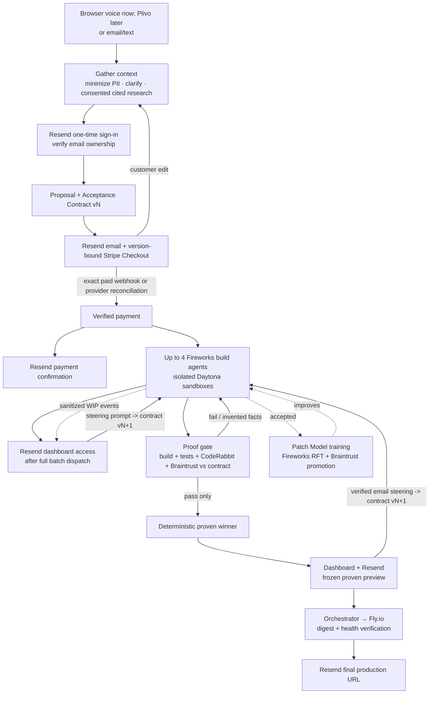

# BuildLabs

**Build anything from a conversation — and prove it before it ships.**

A customer describes a website or application by voice, email, or text. A
durable orchestrator turns that request into a cited, versioned proposal,
collects the exact agreed Stripe payment, and only then dispatches parallel build
agents into isolated sandboxes. Every candidate is built, tested, and evaluated
against the matching Acceptance Contract; anything that invents facts or fails a
hard requirement is thrown away. Customers can watch a sanitized,
passwordless, explicitly unverified build feed as work happens, but only a
**proven** build can become an approvable preview, production deployment, or
delivered result.

Most AI builders optimize for a fast first draft. BuildLabs optimizes for
**proving the result is correct before the customer ever sees it.**

> **Status:** backend implementation in progress. The repository contains the
> isolated four-slot build runtime, sponsor adapters, proof gate, durable
> evidence/outbox, internal API, CopilotKit AG-UI run stream, bounded ElevenLabs
> studio-operation bridges, and the general orchestration layer for proposal,
> payment, email, build, and deploy state. The initial customer-dashboard
> backend slice now includes scanner-safe passwordless exchange, project-scoped
> sessions, bounded signed-capability access-link reissue, terminal-project mail
> recovery, CSRF-protected steering, polling snapshots/events, and sanitized
> build activity. A local Voice Intake workspace reads the bounded ElevenLabs
> archive on demand and forwards signature-verified completed sessions into the
> protected orchestration intake contract without persisting a second transcript
> copy. The browser voice client, Next.js/CopilotKit dashboard frontend, SSE, a
> customer-renderable raster WIP gateway, production-complete session controls,
> and provider-backed end-to-end verification remain separate work.
> Full spec:
> [`PRODUCT_SPEC.md`](./PRODUCT_SPEC.md). Guardrails and real commands:
> [`AGENTS.md`](./AGENTS.md).

## Core commitments

- **Anything the caller wants** — marketing sites, lead-gen sites, or full web
  applications. The voice agent pitches and takes an order for any of them.
- **Smooth contact capture** — voice records name, email, and phone once without
  reading them back. Clicking the emailed passwordless dashboard link verifies
  email ownership; transcription confidence never substitutes for identity.
- **Proven before delivered** — a customer may observe a sanitized,
  non-downloadable `UNVERIFIED WIP` surface, but nothing becomes a review
  preview or deliverable until it builds, passes its tests, is CodeRabbit-clean,
  matches the Acceptance Contract, and invents no business facts.
- **Paid version before building** — build dispatch requires a signed,
  deduplicated Stripe event or an authenticated server-to-server Stripe
  reconciliation whose Checkout, PaymentIntent, project, proposal version,
  customer, amount, currency, mode, and paid status match durable expectations.

Open scope and strong proof pull against each other, so the proof gate is
**adaptive and per-project**: the guarantee is strongest for bounded sites and
honestly weaker for arbitrary apps, and the system reports *what* it proved.

## Pipeline



The orchestrator runs one durable loop for every transcript, reply, webhook, and
builder event:

1. **Gather context** — load the minimum necessary project state, protected PII,
   immutable proposal/contract versions, cited research, payment state, and
   verification receipts. Missing or conflicting requirements become a customer
   clarification, never a guess.
2. **Take one bounded action** — Fireworks plans research, proposal drafting,
   email, Checkout creation, builder dispatch, steering, selection, deploy, or
   delivery.
3. **Verify before advancing** — deterministic code checks schemas, evidence,
   signatures, amount/currency/version, proof receipts, artifact identity,
   deployment health, and provider responses.
4. **Persist and repeat** — an encrypted aggregate, immutable event log,
   verified-webhook inbox, durable effect intentions, and stable provider
   idempotency keys make crash recovery safe across Stripe, Resend, builders,
   and Fly.io.

Customer replies before payment create immutable proposal version `N+1` and a
replacement Checkout Session. After exact payment is verified, up to four
Fireworks builders receive the same end-to-end, version-pinned brief. Their
raw Daytona URLs remain operator-only; the customer dashboard receives a
sanitized durable activity/proof projection labeled `UNVERIFIED WIP`. The
current backend deliberately reports `customerRenderable: false`; the
controller-proxied raster view remains target work. Deterministic ranking
considers only proven candidates, then the customer gets a frozen proven
preview. Any authenticated dashboard prompt or verified email reply enters the
same scope classifier. Accepted in-scope edits create Acceptance Contract
`N+1` and trigger a complete re-proof; commercial expansion returns to proposal
and payment. Dashboard and email surfaces name the exact contract version,
summarize what was proved, and keep iteration open. The orchestrator
owns the Fly.io credential, verifies the deployed digest and HTTPS health, then
Resend sends the final production URL plus a stable, signed link to the exact
recorded contract, `candidate.proven`, artifact, Braintrust trace, and Fly
deployment evidence.

Failure is explicit and fail-closed: invalid webhook signatures are rejected
with bounded, content-free durable security receipts; stale-version payments,
missing facts, no proven candidate, unhealthy deployment, or permanent email
failure cannot fall through to the next stage. The bounded recurring worker
resumes pending idempotent effects; ambiguous requests enter clarification.
Provider effects use persisted capped exponential backoff, stable idempotency
keys, sanitized failure evidence, and dead-letter into operator attention
instead of retrying forever.

Inbound email steering requires both a signed Resend event and cryptographic
verification of an aligned DKIM signature from the provider-retrieved raw
RFC822 message. Raw `Authentication-Results` text is never trusted as proof.

## Tech stack & hosting

| Layer | Choice |
| ----- | ------ |
| Studio / customer dashboard | Next.js (React) + **CopilotKit** + Tailwind |
| Orchestration & agents | TypeScript / Node durable state machine; Fireworks reasoning |
| Inference | **Fireworks AI** (reasoning, code-gen, Patch Model) |
| Sandboxes / preview | **Daytona** |
| Evaluation / tracing | **Braintrust** |
| Voice | **ElevenLabs** |
| Code review | **CodeRabbit** (official headless CLI agent mode) |
| Generated apps | Dockerized; current autonomous deploy path supports self-contained HTTP services |
| **Production hosting** | **Fly.io** — orchestrator deploys the container after the proof gate |
| Email | **Resend** *(non-sponsor)* — proposal, confirmation, proven preview, steering, final URL |
| Payments | **Stripe Checkout** *(non-sponsor)* — mandatory before builds; signed webhook and exact version/amount/currency checks |

**Observation vs preview vs production:** Daytona runs the app live while it is
being built. Operators can inspect raw ephemeral URLs; authenticated customers
currently see only sanitized activity/proof counts labeled `UNVERIFIED WIP`;
the raster gateway is not implemented and no raw Daytona URL crosses this
boundary. A review preview is a frozen, proven snapshot. Fly.io hosts the final
proven result at a real always-on HTTPS URL.
Fly.io was chosen for its Docker-native, token-based unattended deploy
(`flyctl deploy --remote-only` / Machines API) and scale-to-zero pricing. Vercel
and v0 are excluded. The **production deploy token lives only with the
orchestrator — never in a build sandbox.** Dynamic per-project app creation uses
an org-scoped deploy token and required organization slug; an app-scoped deploy
token remains valid for an exact app that was provisioned ahead of time. A
trusted blue/green Fly configuration health-gates every replacement while the
last healthy release stays available.

## Sponsor stack

| Sponsor | Role in BuildLabs |
| ------- | ------------------ |
| **Daytona** | Isolated builder plus fresh command and delivery verifiers per proof attempt; raw operator WIP, sanitized customer observation, and frozen proven previews remain distinct. |
| **Fireworks AI** | All reasoning + code-gen: voice, general orchestration, build agents, and the trained Patch Model. |
| **Braintrust** | Tracing, candidate scoring, the automated evaluation gate, and Patch Model promotion. |
| **ElevenLabs** | Voice + conversational AI for the intake agent; embedded voice for spoken edits in the studio. |
| **CopilotKit** | The role-separated studio and customer workspace: contract cards, candidate comparison, diffs, steering, component tree, and four live panes. |
| **CodeRabbit** | Structured headless CLI review per frozen candidate; findings feed in-loop fixes and critical findings block proof. |

**Dropped:** WorkOS. BuildLabs uses a narrower application-owned boundary:
separate operator access and project-scoped passwordless customer sessions.

## Sponsor integration surfaces

- **Daytona:** the controller content-attests the frozen source, hydrates two
  fresh verifier sandboxes from those exact bytes, deletes the builder and
  command verifier, and promotes only a passing delivery verifier. Docker daemon
  startup gets a bounded 120-second readiness window with redacted daemon-exit
  diagnostics; a Docker-runtime initialization failure is deleted synchronously
  and retried once in a fresh sandbox before surfacing an unreclaimed resource.
  Sandbox telemetry is labeled by run, project,
  candidate, and role; SDK shutdown disposes its event/OTEL resources. After
  delivery build checks, the controller applies Daytona's persisted
  `networkBlockAll` outbound firewall before starting proof services and
  reapplies it after snapshot restart. The pinned
  `buildlabs-dind-browser-v2` snapshot uses stable differential
  Playwright/Chromium paint evidence with same-origin browser traffic. Starting
  from the root and contract HTTP paths, it deterministically crawls at most 32
  frozen-DOM routes and inspects up to 16 vertical viewport tiles per page;
  every tile digest is bound into the receipt while bounded PNG bytes remain
  controller-only for visual-claim inspection. Up to 15 visible controls are
  replayed through a bounded fresh-state graph. Normal forms receive
  controller-owned canonical values one field at a time before a prevented
  submit, while finite select/radio/checkbox choices, same-page fragment links,
  authored CSS hover/focus states are probed explicitly; handler-driven
  hover/focus states must produce a semantic transition and continue through
  the bounded graph. Child states reuse a parent's tile proof only after the
  offset, dimensions, candidate geometry, and PNG bytes match exactly, and
  duplicate text states/tile digests are emitted once. Initial WebSockets and
  every HTTP/WebSocket request attempted after load fail the route instead of
  accepting a degraded state. Click-revealed claims join the same evidence;
  unobservable stateful actions, repeated-action or state-graph overflow, and
  unsupported form controls fail closed. Hidden, below-fold,
  transparent, same-color, low-opacity, clipped, occluded, or
  transient-background DOM text cannot satisfy a hard HTTP receipt. Canvas,
  embedded media/frames, data/blob images, and generated pseudo-element text
  fail closed when the controller cannot prove their visible claims. A
  transient post-probe compositor mismatch gets at most four paint-spaced
  recaptures and must produce two consecutive byte-exact baseline PNGs;
  persistent drift fails with numeric-only diagnostics.
- **Fireworks:** interleaved tool reasoning is preserved only in transient model
  context; project-isolated prompt caching and bounded performance telemetry are
  enabled without persisting raw reasoning. Coding agents default to Kimi K2.7
  Code, short Studio turns use the Kimi K2.6 Turbo router, and the evaluator is
  independently configurable. A separate
  [Kimi K2.6](https://fireworks.ai/models/fireworks/kimi-k2p6) vision role uses
  Fireworks'
  [multimodal API](https://docs.fireworks.ai/guides/querying-vision-language-models)
  to inspect bounded supported source rasters and the exact Chromium PNG tiles for forbidden or
  unsupported visible business assertions, including when the contract has no
  explicit forbidden list. Forced structured results are digest-bound and
  Braintrust receives only indices, digests, counts, and statuses — no image
  bytes or OCR text. Unreadable output, malformed responses, animated/multipage
  formats, and provider failures block proof; static WebP/AVIF/HEIF pixels are
  covered through rendered screenshots without host-native decoding. Health
  checks execute the structured readiness
  tool on every distinct configured model rather than relying on a partial
  catalog listing. Contract PASS citations are checked against
  controller-issued evidence groups for each specific verifier.
  Semantic verifiers rank preferences only; hard requirements require command
  or rendered-HTTP evidence. Patch Model curation now produces opted-in,
  project-pseudonymous structural records and deterministic receipt-derived
  rewards, but it deliberately does not claim Fireworks training readiness:
  training `messages`, the Eval Protocol remote `/init` service, evaluator
  upload, and RFT job creation remain unconfigured.
- **Braintrust:** build, score, model, review, Studio, and webhook operations are
  traced; Fireworks cache/token/latency values are native metrics. Voice traces
  contain only opaque correlations, counts, allowlisted decisions, and run IDs,
  and the build proof gate fails closed if its required trace flush fails. Patch
  records publish into
  separate project-scoped, bundle-specific train/held-out datasets. Held-out
  comparisons verify a controller-attested bundle and the reopened provider
  dataset ID/version, use keyed case IDs to keep structurally identical cases
  distinct, and pin the explicit base experiment ID. A domain-separated bundle
  HMAC covers its recomputed contents, project, curation policy, and consent
  receipts; result HMACs bind project, bundle, dataset, model role/resource,
  output, reward, and evidence. A final HMAC makes unsigned or altered
  comparison objects ineligible. Signing keys never enter Braintrust payloads.
  Missing diffs, any score regression, fewer than 20 cases, or less than a 0.02
  terminal improvement blocks eligibility. A passing comparison is only
  `eligible-for-manual-promotion`; this backend never changes a Fireworks model
  alias or deploys a checkpoint.
- **CodeRabbit:** each frozen review receives a deterministic,
  controller-authored Acceptance Contract policy through `--config`; candidate
  review-control files are rejected and the policy digest is proof evidence.
  Unsupported business claims are critical findings and block proof. Explicit
  rate limits and a missing terminal completion receive at most three attempts
  with 15/30-second backoff; protocol, policy, and permanent failures stop
  immediately, and exhaustion remains fail-closed.
- **CopilotKit:** `POST /v1/integrations/copilotkit/agent` streams authenticated
  AG-UI run snapshots, stable activity state, contract/progress/proof summaries,
  durable events, cursor continuation, keepalives, and terminal completion over
  SSE or protobuf. Durable replay is read in 256-event pages, and the REST event
  endpoint exposes bounded `limit`, `nextAfter`, and `hasMore` pagination.
  Unsupported interrupt resumes are rejected and concurrent observer streams
  are bounded.
- **ElevenLabs:** authenticated, bounded webhook tools expose candidate status,
  evidence summaries, and compare-and-set cancellation with durable redacted
  provenance. A cancellation requires the official
  `system__conversation_id`/`system__conversation_history` variables, an
  explicit latest-user cancel instruction verified locally, and a short-lived
  controller-signed capability bound to a fresh candidate read. Cancellation
  events retain only a controller-owned reason code, never conversation text or
  bearer material. When `ELEVENLABS_SPEECH_ENGINE_ID` is configured, the backend
  attaches the official Speech Engine WebSocket SDK and exposes an
  internal-authenticated `/v1/integrations/elevenlabs/webrtc-token` endpoint so
  the browser receives a short-lived conversation token, never the API key.
- **Status:** public `GET /ready` performs no sponsor network calls and reports
  local configuration. Authenticated `POST /v1/integrations/probe` performs a
  bounded, single-flight deep probe with a short cache. `GET /v1/integrations`
  reports all six sponsor responsibilities and the latest cached status,
  separating `unconfigured`, `configured`, `healthy`, and
  `end-to-end-verified`; it does not call an uncreated remote resource healthy.

## Deferred (not wired yet)

- **Plivo PSTN transport adapter** — browser voice comes first; a later Plivo
  adapter will carry the same ElevenLabs/Fireworks normalized intake, but it is
  not wired here yet.
- **Controller-attested acceptance-test bundles** — project test commands are
  candidate-owned build evidence; independent requirement proof currently comes
  from explicit contract command and rendered-HTTP receipts.
- **No prior-codebase reuse** — built fresh; BuildStax is not reused.

Stripe payment is no longer deferred: a version-bound Checkout payment is a
mandatory gate before builder dispatch.

## Repository layout

```text
.
├── apps/
│   └── voice-intake/ # Local ElevenLabs archive and signed intake bridge
├── src/
│   ├── adapters/     # Sponsor providers, SQLite, artifacts
│   ├── application/  # Agent/studio loops, scheduler, verification, proof gate
│   ├── domain/       # Acceptance contracts, runs, evidence, artifacts
│   ├── http/         # Fastify API and AG-UI transport
│   ├── orchestration/
│   │   ├── domain/       # Projects, immutable versions, lifecycle/events
│   │   ├── application/  # Gather/action/verify workflow and transition policy
│   │   ├── ports/        # Stripe, Resend, research, builders, deploy interfaces
│   │   ├── adapters/     # Provider, encrypted state, inbox, and effect-ledger implementations
│   │   └── http/         # Intake, passwordless dashboard, steering, and provider webhooks
│   ├── orchestration-index.ts # General-orchestrator composition root
│   └── ports/        # Provider and persistence interfaces
├── scripts/          # Daytona provisioning and bounded live provider probes
├── tests/            # Build/proof tests plus orchestration*.test.ts lifecycle tests
├── PRODUCT_SPEC.md   # Full product specification (source of truth)
├── CUSTOMER_DASHBOARD_SPEC.md # Customer workspace UX, auth, events, and states
├── AGENTS.md         # Guidance, guardrails, and development commands
├── ORCHESTRATION_RUNTIME.md  # Runtime/configuration guide
├── ORCHESTRATION_PROGRESS.md # Concise implementation/test checkpoint log
└── README.md         # This file
```

## Run and verify

Requires Node.js 24+ and pins this repository to npm 11.17.0. Run `npm install`,
provision or validate the Daytona
Docker-in-Docker + Chromium snapshot with `npm run provision:daytona`, then run
`npm run check`. The provisioner performs real Docker build/run and rendered
visibility probes before accepting the snapshot. Development uses `npm run dev`
for the build backend and `npm run dev:orchestration` for the general
orchestrator. `npm run dev:voice` starts the local Voice Intake workspace; its
server-only bridge requires `ELEVENLABS_AGENT_ID`, `ELEVENLABS_API_KEY`,
`ELEVENLABS_WEBHOOK_SECRET`, and `ORCHESTRATION_INTERNAL_TOKEN`. It defaults to
the local orchestrator at `http://127.0.0.1:3100`.

After `npm run build`, `npm start` is the production supervisor: it sets
`NODE_ENV=production`, starts both compiled backends, and stops the pair if
either process exits. To operate them separately, use
`npm run start:build-backend` and `npm run start:orchestration`. Production
configuration requires live-mode Stripe credentials and real routable sender,
reply, webhook, and Checkout-return domains.

Set `ORCHESTRATION_PUBLIC_BASE_URL` to the orchestrator's public HTTPS base and
register its derived `/v1/orchestration/webhooks/stripe` and
`/v1/orchestration/webhooks/resend` endpoints with those providers. The
authenticated orchestrator `/ready` check covers Fireworks, Braintrust, Stripe,
Resend, Fly.io, and the authenticated build backend with its exact Daytona
snapshot contract. `npm run smoke:providers` performs only real, read-only
provider calls; it requires configured credentials and an already-running,
reachable build backend.

The operator backend can read complete protected project state and evidence at
`GET /v1/orchestration/projects/:projectId/evidence` with
`ORCHESTRATION_INTERNAL_TOKEN`; immutable events use bounded cursor pagination,
and failed effects/dead letters are explicit. This is a privileged
single-operator API whose token is global, not a customer endpoint or
project-scoped authorization system. Customer proof-summary links instead use a
narrow HMAC capability bound to one encrypted immutable snapshot and expose no
protected customer contact or billing data. These links are transferable bearer
credentials with no per-link expiry; use the protected revocation endpoint for
compromise/privacy response, suppress their raw paths in every proxy/CDN log,
and apply an edge-wide limiter in multi-instance deployments. The built-in
digest-keyed limiter is per process and deliberately ignores forwarded IP
headers.

The initial customer dashboard backend uses these public, project-scoped
routes:

| Route | Current behavior |
| ----- | ---------------- |
| `GET /v1/orchestration/customer-dashboard/access` | Inert no-store exchange page; the emailed 15-minute token stays in the URL fragment and is removed before use. |
| `POST /v1/orchestration/customer-dashboard/access` | Atomically consumes the one-time token with email ownership verification, then issues a seven-day signed project session and session-bound CSRF cookie. |
| `POST /v1/orchestration/customer-dashboard/access/requests` | Always returns generic `202`; an active or at-most-30-days-expired signed capability can create only one request family for its digest and mail only the protected project email. Reissue is capped at 32 request families per project. |
| `GET /v1/orchestration/customer-dashboard/projects/:projectId` | Returns the current plan/payment/build projection, sanitized run activity, and the last known-good proven preview/production release. |
| `GET /v1/orchestration/customer-dashboard/projects/:projectId/events` | Returns bounded, payload-free polling events. |
| `POST /v1/orchestration/customer-dashboard/projects/:projectId/steering` | Requires the project session, CSRF header, `Idempotency-Key`, expected aggregate revision, and expected proposal version; `202` means received for orchestration, not accepted scope. |

The build backend supplies the orchestrator-only safe projection at
`GET /v1/build-runs/:runId/customer-observability`; it never includes raw logs,
prompts, commands, sandbox IDs, mutable preview URLs, reasoning, or artifact
contents. The access response redirects to `/dashboard/projects/:projectId`,
which is a route for the separate frontend and is not served by this repository.

The reissue path reloads after an optimistic conflict at most three times. Each
request family can rotate an unsent 15-minute capability at most three delivery
generations, and different request families remain subject to the durable
one-minute project floor. Provider retries honor only the exact dashboard-login
effect's persisted schedule and budget. SQLite schema v6 keeps a content-free
pending-login bit, including a migration backfill, so even a terminal project
remains discoverable until that mail effect settles.

Server-side session revocation/logout and renewal, a generic email-entry request
flow, edge-wide access rate limits, opaque customer aliases, SSE, the frontend,
the raster WIP gateway, and provider-backed end-to-end verification remain open
before this boundary is production-complete.

One build API assignment creates one Fireworks candidate agent in one isolated
Daytona builder, followed by two fresh proof verifiers. Initial scaffolds can be
written through one bounded multi-file tool call, each tool result is durable
progress, and startup recovery deletes recorded sandboxes from interrupted
runs. The assignment's model-turn cap stays hard (60 by default): an in-budget
finalization window reserves the last turn for preview or finish, and a
previewed revision that exhausts the cap receives a traced
`budget_exhausted_handoff` to independent verification instead of being
discarded. Exhaustion before any successful preview still fails closed. Fresh
command verifiers scan shipped source before candidate commands and
restore only one root frozen lockfile with lifecycle scripts disabled. Nested
package roots and mixed lockfile families are rejected; pnpm and Yarn projects
must declare an exact `packageManager` version. The generated root lockfile body
is omitted from semantic model context, but remains bound by the frozen revision
and required dependency-bootstrap receipt; all application source remains
subject to complete bounded inspection. The bootstrap result is proof evidence.
Builder instructions explicitly prohibit forbidden phrases in tracked tests,
fixtures, comments, and docs; negative tests prove supported output without
embedding or encoding forbidden literals.
The general orchestrator submits up to four version-pinned
assignments and consumes typed `candidate.proven` events to rank and deploy the
winner. Each event carries an authenticated, backend-relative source artifact
URL at
`/v1/build-runs/:runId/artifacts/:artifactId`; artifact downloads are
identity-bound and integrity-checked before streaming.

Current research is deliberately fail-closed: the customer must explicitly
authorize and name an owned HTTPS URL. The adapter captures cited text with
DNS/redirect/SSRF defenses; automatic business-name discovery and reusable
image licensing are not yet implemented. Likewise, database/auth/secret/volume
provisioning needs a future contract-bound runtime manifest before arbitrary
persistent applications can be delivered autonomously. Customer contact PII is
currently excluded from every builder; publishing a contact field in a generated
site needs a future field-level approval path.
