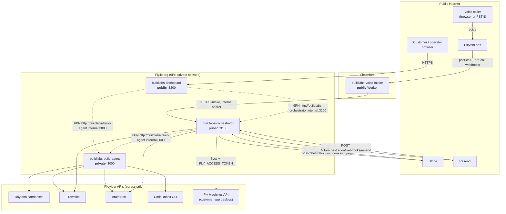

# BuildLabs deployment runbook

How the four BuildLabs services are deployed, wired, and verified. Three run on
Fly.io from this repository's Dockerfiles; the voice intake agent runs on
Cloudflare Workers.

Every deployment artifact referenced here lives at the repository root unless
stated otherwise: `Dockerfile`, `apps/dashboard/Dockerfile`,
`fly.build-agent.toml`, `fly.orchestrator.toml`, `fly.dashboard.toml`,
`apps/voice-intake/wrangler.jsonc`.

## Services

| Service                  | Platform           | Exposure                        | Port | Health     | State                     |
| ------------------------ | ------------------ | ------------------------------- | ---- | ---------- | ------------------------- |
| `buildlabs-build-agent`  | Fly Machines       | **private** (6PN only, no IP)   | 3000 | `/health`  | volume: SQLite, artifacts |
| `buildlabs-orchestrator` | Fly Machines       | **public** (webhook receiver)   | 3100 | `/health`  | volume: SQLite            |
| `buildlabs-dashboard`    | Fly Machines       | **public** (customer, operator) | 3200 | `/healthz` | stateless                 |
| `buildlabs-voice-intake` | Cloudflare Workers | **public** (ElevenLabs bridge)  | —    | —          | stateless                 |

The two Node services share one image (root `Dockerfile`); each Fly app picks
its entrypoint through `[processes]` in its own `fly.*.toml`. The single-host
supervisor `dist/production-index.js` (`npm start`) is **not** used on Fly: each
service is its own app so it can be scaled, exposed, and restarted
independently.

## Topology



Solid arrows cross the public internet; dotted arrows stay on Fly's private 6PN
network. Nothing reaches the build agent from outside the organization.

### Why two public origins, and no edge router

The orchestrator and the dashboard are **deliberately separate public origins**.
There is no shared edge router, reverse proxy, or single-origin rewrite layer,
and none is required:

- **The orchestrator's public origin exists for machines.** Stripe and Resend
  must post to a stable HTTPS URL and verify signatures against it. That is the
  only reason it is public.
- **The dashboard's public origin exists for people.** It owns the customer
  session cookie and the opaque project alias, and it proxies the orchestrator
  **server-side** over 6PN
  (`apps/dashboard/lib/server/orchestration-client.ts`). No browser ever talks
  to the orchestrator directly, so no cross-origin cookie, CORS allowance, or
  shared parent domain is needed.
- Because the dashboard is the customer surface, **emailed login capabilities
  must point at the dashboard**, not at the orchestrator. That is what
  `ORCHESTRATION_DASHBOARD_BASE_URL` does. It defaults to
  `ORCHESTRATION_PUBLIC_BASE_URL` purely so a single-origin proxy deployment
  still works — in this two-origin topology it is **required**, and customer
  login links land on the wrong host without it. It must be the dashboard's
  public origin; the dashboard serves the capability at `/v1/customer/access`.

Adding an edge router later would only move where TLS terminates; it would not
change any of the above.

## Prerequisites

- `flyctl` authenticated against the target organization (`fly auth login`).
- `wrangler` (already a workspace devDependency) authenticated against the
  target Cloudflare account (`npx wrangler login`).
- Node >= 24 and npm 11.17.0 locally, for the provisioning and reconciler
  scripts.
- Live-mode Stripe credentials, a verified Resend sending/receiving domain, and
  the sponsor API keys.

Pick the app names once. This runbook uses `buildlabs-build-agent`,
`buildlabs-orchestrator`, `buildlabs-dashboard`, and `buildlabs-voice-intake`,
matching the committed configs. Changing a name means changing the `app` key in
the corresponding `fly.*.toml` **and** every `*.internal` URL that refers to it.

## Deploy order

Deploy bottom-up, so each service's upstream already answers when it boots:

1. `buildlabs-build-agent` — depends on nothing inside the org.
2. `buildlabs-orchestrator` — calls the build agent; readiness probes it.
3. `buildlabs-dashboard` — proxies both Node services.
4. `buildlabs-voice-intake` — posts intakes to the orchestrator's public origin.

Public hostnames are predictable (`https://<app>.fly.dev`), so there is no
chicken-and-egg problem: every URL can be set before the first deploy.

### 1. Build agent (private)

```bash
fly apps create buildlabs-build-agent --org <your-org>

# SQLite run state + proven artifacts. Sized for artifact retention.
fly volumes create buildlabs_build_agent_data \
  --app buildlabs-build-agent --region sjc --size 10

fly secrets set --app buildlabs-build-agent \
  BUILDLABS_INTERNAL_TOKEN="$(openssl rand -base64 48)" \
  DAYTONA_API_KEY=... \
  FIREWORKS_API_KEY=... \
  BRAINTRUST_API_KEY=...

fly deploy -c fly.build-agent.toml
```

Keep the generated `BUILDLABS_INTERNAL_TOKEN`: the orchestrator and the
dashboard both authenticate to this service with it.

**Confirm it is not public.** `fly.build-agent.toml` declares no
`[http_service]`, so the Fly proxy has nothing to route — but verify no address
was allocated:

```bash
fly ips list --app buildlabs-build-agent          # expect an empty list
fly ips release <addr> --app buildlabs-build-agent  # only if one exists
```

Optional ElevenLabs bridge secrets (`ELEVENLABS_API_KEY` +
`ELEVENLABS_SPEECH_ENGINE_ID`, and `ELEVENLABS_TOOL_SECRET` +
`ELEVENLABS_CAPABILITY_SECRET`) are set on this app only if the speech-engine
bridge is enabled; each pair is all-or-nothing.

### 2. Orchestrator (public)

```bash
fly apps create buildlabs-orchestrator --org <your-org>

fly volumes create buildlabs_orchestration_data \
  --app buildlabs-orchestrator --region sjc --size 3

fly secrets set --app buildlabs-orchestrator \
  ORCHESTRATION_ENCRYPTION_KEY_BASE64="$(openssl rand -base64 32)" \
  ORCHESTRATION_REPLY_SECRET_BASE64="$(openssl rand -base64 32)" \
  ORCHESTRATION_INTERNAL_TOKEN="$(openssl rand -base64 48)" \
  BUILD_BACKEND_INTERNAL_TOKEN="<build agent BUILDLABS_INTERNAL_TOKEN>" \
  FIREWORKS_API_KEY=... \
  BRAINTRUST_API_KEY=... \
  STRIPE_SECRET_KEY=sk_live_... \
  STRIPE_WEBHOOK_SECRET=whsec_... \
  RESEND_API_KEY=re_... \
  RESEND_WEBHOOK_SECRET=... \
  FLY_ACCESS_TOKEN=...
```

Then fill in the deployment-specific **non-secret** values that
`fly.orchestrator.toml` leaves commented out — either uncomment them there and
commit, or set them with `fly secrets set` if you would rather not commit your
domains:

| Variable                           | Value                                     |
| ---------------------------------- | ----------------------------------------- |
| `ORCHESTRATION_PUBLIC_BASE_URL`    | `https://buildlabs-orchestrator.fly.dev`  |
| `ORCHESTRATION_DASHBOARD_BASE_URL` | `https://buildlabs-dashboard.fly.dev`     |
| `ORCHESTRATION_REPLY_DOMAIN`       | your Resend receiving domain              |
| `ORCHESTRATION_FROM_EMAIL`         | `BuildLabs <hello@yourdomain>`            |
| `STRIPE_SUCCESS_URL`               | dashboard HTTPS return route              |
| `STRIPE_CANCEL_URL`                | dashboard HTTPS cancel route              |
| `FLY_ORG_SLUG`                     | the org that owns generated customer apps |

```bash
fly deploy -c fly.orchestrator.toml
```

Config validation refuses to boot in production if any of these is missing, if
Stripe is not live-mode, if a customer-facing hostname is a reserved
placeholder, if `ORCHESTRATION_INTERNAL_TOKEN` equals
`BUILD_BACKEND_INTERNAL_TOKEN`, or if the encryption key equals the reply
secret. Those are deliberate fail-closed checks — read the startup log rather
than relaxing them.

### 3. Dashboard (public)

```bash
fly apps create buildlabs-dashboard --org <your-org>

fly secrets set --app buildlabs-dashboard \
  BUILDLABS_INTERNAL_TOKEN="<build agent BUILDLABS_INTERNAL_TOKEN>" \
  BUILDLABS_OPERATOR_TOKEN="$(openssl rand -base64 48)" \
  BUILDLABS_DASHBOARD_ALIAS_SECRET="$(openssl rand -base64 48)" \
  BUILDLABS_DASHBOARD_INTERNAL_TOKEN="$(openssl rand -base64 48)" \
  BUILDLABS_DASHBOARD_WIP_ATTESTATION_SECRET="$(openssl rand -base64 48)" \
  BUILDLABS_DASHBOARD_WIP_POLICY_DIGEST="<64-character hex digest>"

fly deploy -c fly.dashboard.toml
```

`BUILDLABS_ORCHESTRATION_URL` and `BUILDLABS_BUILD_BACKEND_URL` are already set
to the 6PN names in `fly.dashboard.toml`. Plaintext HTTP is accepted for those
two only because `*.internal` is a private host; anything publicly routable must
be HTTPS (`isPrivateServiceHost()` in
`apps/dashboard/lib/server/orchestration-client.ts`).

The dashboard image is a Next.js standalone build produced from the repository
root (`apps/dashboard/Dockerfile`), which requires `output: "standalone"` in
`apps/dashboard/next.config.ts`.

### 4. Voice intake (Cloudflare Worker)

The Worker is **not** deployed to Fly. It is built by vinext +
`@cloudflare/vite-plugin`; the committed `apps/voice-intake/wrangler.jsonc`
supplies the name, compatibility date/flags, the `ASSETS` and `IMAGES` bindings,
and observability, and the build emits the deployable config to
`apps/voice-intake/dist/server/wrangler.json` (never edit that file).

```bash
npm run build --workspace @buildlabs/voice-intake
cd apps/voice-intake
npx wrangler deploy --dry-run     # optional: prints the resolved bindings
npx wrangler deploy
```

Then set every secret. **Secrets are never committed**; `wrangler secret put`
stores them on the Worker and they take effect without a redeploy:

```bash
cd apps/voice-intake
for name in \
  ELEVENLABS_API_KEY ELEVENLABS_AGENT_ID ELEVENLABS_AGENT_VERSION_ID \
  ELEVENLABS_BRANCH_ID ELEVENLABS_CAPABILITY_SECRET ELEVENLABS_TOOL_SECRET \
  ELEVENLABS_CUSTOM_LLM_SECRET ELEVENLABS_WEBHOOK_SECRET \
  VOICE_SESSION_SECRET VOICE_INTAKE_ALLOWED_ORIGINS \
  FIREWORKS_API_KEY FIREWORKS_VOICE_MODEL \
  ORCHESTRATION_INTERNAL_TOKEN BUILDLABS_ORCHESTRATION_URL; do
  npx wrangler secret put "$name"
done
```

- `ORCHESTRATION_INTERNAL_TOKEN` must match the orchestrator's value.
- `BUILDLABS_ORCHESTRATION_URL` must be the orchestrator's **public HTTPS
  origin** (`https://buildlabs-orchestrator.fly.dev`). A Cloudflare Worker
  cannot reach Fly's 6PN network, so the `*.internal` form is wrong here.
- `VOICE_INTAKE_ALLOWED_ORIGINS` is a comma-separated list of exact origins and
  is required in production.
- `ELEVENLABS_PRECALL_SECRET` is additionally required if the inbound PSTN
  (Plivo) route is enabled; `CALL_LAB_ACCESS_CODE` gates the operator Call Lab.
- `npx wrangler secret bulk secrets.json` sets many at once; delete the file
  afterwards.

## Webhook registration

Register these only after the receiving service is deployed and healthy.

| Source                  | Destination                                                          |
| ----------------------- | -------------------------------------------------------------------- |
| Stripe                  | `{ORCHESTRATION_PUBLIC_BASE_URL}/v1/orchestration/webhooks/stripe`   |
| Resend                  | `{ORCHESTRATION_PUBLIC_BASE_URL}/v1/orchestration/webhooks/resend`   |
| ElevenLabs post-call    | `https://<voice-intake worker origin>/api/webhooks/elevenlabs`       |
| ElevenLabs SIP pre-call | `https://<voice-intake worker origin>/api/telephony/elevenlabs/init` |

- Copy Stripe's signing secret into `STRIPE_WEBHOOK_SECRET` and Resend's into
  `RESEND_WEBHOOK_SECRET`; both services verify signatures and reject unsigned
  deliveries.
- The ElevenLabs endpoints are **not** registered by hand. Set
  `BUILDLABS_VOICE_PUBLIC_BASE_URL` to the Worker origin and run the
  repository's reconciler, which is read-only until explicitly applied:

  ```bash
  npm run elevenlabs:reconcile
  npm run elevenlabs:reconcile -- --apply \
    --expected-base-version=<version_id_from_the_plan>
  ```

  See `apps/voice-intake/README.md` for what the reconciler will and will not
  change.

- The post-call webhook returns success only after the orchestrator durably
  records the intake, so ElevenLabs redelivery is the intended retry path.

## Volumes and persistent state

Two services keep SQLite state and must never run more than one machine per
volume:

| App                      | Volume                         | Mount   | Contents                                                  |
| ------------------------ | ------------------------------ | ------- | --------------------------------------------------------- |
| `buildlabs-build-agent`  | `buildlabs_build_agent_data`   | `/data` | `build-agent.db`, `artifacts/`, `daytona/`, `coderabbit/` |
| `buildlabs-orchestrator` | `buildlabs_orchestration_data` | `/data` | `orchestration.db`, `tmp/`                                |

Both `fly.*.toml` files declare `initial_size`, so `fly deploy` can create the
volume on first deploy; creating it explicitly (above) makes the size and region
intentional. Keep `fly scale count 1` for both.

**Volume ownership.** The images run as the non-root `node` user and create
`/data` owned by `node`. A volume created before that, or restored from a
snapshot, may still be owned by `root`. If the service logs `EACCES` on the
database path:

```bash
fly ssh console --app buildlabs-build-agent -C "chown -R node:node /data"
fly machine restart <machine-id> --app buildlabs-build-agent
```

**Daytona snapshot attestation.** The build agent re-verifies a signed snapshot
attestation before it will acquire a sandbox, and the attestation goes stale
after seven days. It is generated outside the runtime and lives on the volume so
it can be refreshed without a rebuild:

```bash
npm run provision:daytona          # writes .buildlabs/daytona/snapshot-attestation.json
fly ssh console --app buildlabs-build-agent -C "mkdir -p /data/daytona"
fly ssh sftp shell --app buildlabs-build-agent
# put .buildlabs/daytona/snapshot-attestation.json /data/daytona/snapshot-attestation.json
```

The matching provisioner source (`scripts/provision-daytona-snapshot.ts`) is
baked into the image and re-hashed at acquisition time; the attestation and the
image must therefore be refreshed together if that script changes.

**CodeRabbit authentication.** `CODERABBIT_AUTH_MODE=preauthenticated` means the
runtime never receives a CodeRabbit key as an argument or environment value; it
reads an already-authenticated home at `CODERABBIT_AUTH_HOME=/data/coderabbit`.
Seed it once, on the machine, by running the CodeRabbit CLI's login flow with
`HOME=/data/coderabbit`, or by copying an authenticated home into the volume.
The CLI binary itself is installed in the image (skip it with
`--build-arg INSTALL_CODERABBIT_CLI=false`).

## Verification

```bash
# Public services
curl -fsS https://buildlabs-orchestrator.fly.dev/health
curl -fsS https://buildlabs-dashboard.fly.dev/healthz

# Private build agent, from inside the 6PN network
fly ssh console --app buildlabs-orchestrator \
  -C "curl -fsS http://buildlabs-build-agent.internal:3000/health"

# Deeper readiness (reports every configured sponsor; 503 until all are set)
fly ssh console --app buildlabs-orchestrator \
  -C "curl -fsS http://buildlabs-build-agent.internal:3000/ready"

# Or tunnel the private service to your workstation
fly proxy 3000:3000 --app buildlabs-build-agent
```

`/health` is liveness only. `/ready` probes external providers, which is why the
Fly health checks target `/health` (and `/healthz` for the dashboard): a
third-party outage should page an operator, not pull a machine out of rotation.

Before deploying, `npm run check:config` reports, per service, which variables
are missing or malformed. It prints names and constraints only, never values.

## Rollback

```bash
fly releases --app buildlabs-orchestrator
fly deploy --app buildlabs-orchestrator --image <previous image ref>
```

The dashboard is stateless and uses a blue/green strategy, so a failed release
never takes traffic. The two volume-backed apps use `rolling` because Fly does
not support blue/green with mounted volumes and only one machine may own a
SQLite file; expect a short gap while the machine restarts. SQLite schema
migrations run at startup, so there is no release command to coordinate.

## Security notes

- **`FLY_ACCESS_TOKEN` belongs to the orchestrator app and to nothing else.** It
  is org-scoped so the orchestrator can create per-project customer apps. It
  must never be set on `buildlabs-build-agent`, never be exposed to the
  dashboard or the Worker, and never enter a Daytona sandbox. The build agent
  does not deploy; it proves. Deploying is the orchestrator's job precisely so
  that this credential stays out of the code-generation blast radius.
- **The build agent stays private.** It has no public IP and no
  `[http_service]`. Its `/health` and `/ready` endpoints are unauthenticated,
  which is only acceptable because nothing outside the organization's 6PN
  network can reach them. Every other route requires the
  `BUILDLABS_INTERNAL_TOKEN` bearer.
- **Tokens are per-trust-boundary, not shared.** `ORCHESTRATION_INTERNAL_TOKEN`
  (voice intake and operators calling the orchestrator) must differ from
  `BUILD_BACKEND_INTERNAL_TOKEN` (the orchestrator calling the build agent); the
  orchestrator refuses to start if they match.
- **Nothing secret is committed.** `fly.*.toml` and `wrangler.jsonc` hold
  non-secret configuration only; credentials arrive through `fly secrets set`
  and `wrangler secret put`. `.dockerignore` excludes every `.env*` file from
  both build contexts.
- **Rotation.** `fly secrets set` restarts the machines, and
  `wrangler secret put` takes effect immediately. Rotate
  `BUILDLABS_INTERNAL_TOKEN` on the build agent, the orchestrator
  (`BUILD_BACKEND_INTERNAL_TOKEN`), and the dashboard together.
